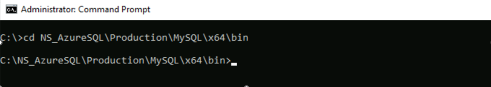
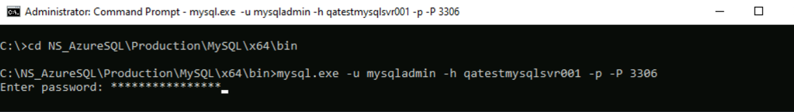
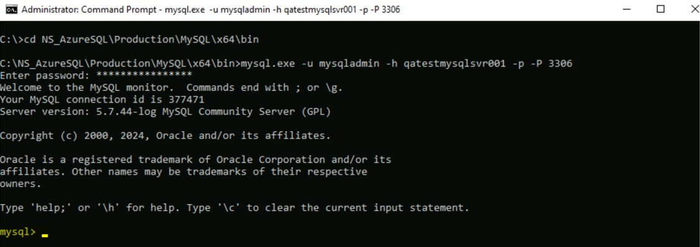
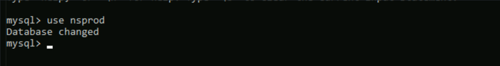
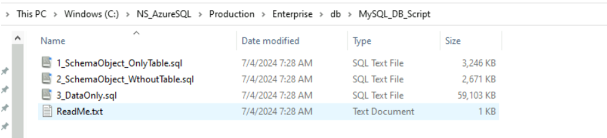
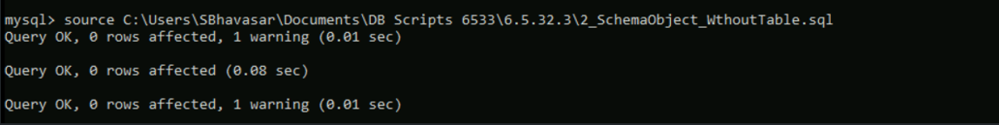
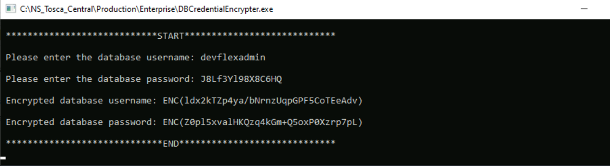
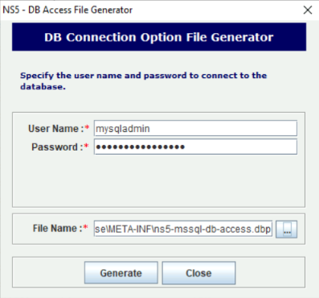
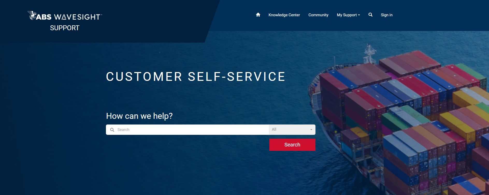

---
tags:
  - documentation
  - installation-guide
  - azure
  - cloud
  - mysql
  - database
  - nautical-systems
  - version-7.0.0
  - abs-wavesight
  - azureflex
  - enterprise
---

[← Back to Home](index.md)

**Nautical Systems
Azure Cloud Installation Guide**

Version 7.0.0 \| September 2025

# Introduction

This document provides step-by-step instructions required for installing configuring the **AzureFlex Server Database** using **MySQL** for use with *ABS Wavesight Nautical Systems ™* version **7.0.0**. It includes database setup, schema configuration, parameter modifications, credential updates, and backup/restore procedures to ensure the **AzureFlex Server** environment is properly initialized and ready to support enterprise applications.

**Release Date** --- September 2025

[[#Revision History]]

### Azure MySQL Server Details

The server details vary depending on the environment and customer. Should you need this information, log into the [Customer Self-Service Portal](https://abssupport.powerappsportals.com/) where you can submit a ticket for the *Cloud Services* team to assist.

Here is an example:

- **Server IP Address**: XX.XX.XXX.XXX

- **Host Name**: xyz01.mysql.database.azure.com

- **User Name**: xyzabs / mysqladmin

- **Password**: xxxxxxxxxxx

- **Port**: XXXX

### Recommendations for Installation Support

To ensure the smoothest possible experience with *ABS Wavesight Nautical Systems™*, we highly recommend allowing our team to assist with the installation. Our experts can help avoid common setup issues and ensure all components are properly configured for optimal performance. Please contact your Account Manager to learn more about how our *Professional Services* team can assist.

*\*

# Azure MySQL Server and DB Configuration

For cloud installation using **MySQL Server** as a service, follow the steps below:

Steps

1.  Set up the database server:

    - **MySQL 8.x** is supported.

    - **MySQL** configuration and performance parameters should be updated from their default values.

    - Each application installation must use unique database credentials. For example, if a database server hosts both *Production* and *Training* databases, separate database users must be created for each. Refer to the [[#Configuring Database Schemas]] for recommended guidance.

2.  Install the application:

    - Use the default embedded server install for *MySQL* or *MariaDB*, depending on the license and database selection for the remote site.

3.  Prepare the cloud database:

    - Create a new database with the required collation and character set.

    - Create a new user or grant privileges to access the database created in the first step.

    - Switch to the new database using the **USE** keyword.

    - Execute the **DB Schema** scripts before connecting the application to the cloud database.

    - The scripts are available under: **Enterprise\\db\\MySQL_DB_Script**

4.  Configuring the application:

    - Update the application properties to connect with the cloud database.

    - Update the connection details for all applications.

    - For more information, refer to the **Database Configuration** section.

5.  Disable database validation at startup:

    - When the application starts, database validation must be disabled.

    - Ensure that any NS application that connects with the cloud instance of the database must include the following line added to:

       - *Enterprise\\conf\\vm.prop*

       - *Dstrict.db.validation=false*

6.  (*Recommended*) To declutter the services listing, it is recommended that you remove the MySQL services as they are not in use.

    - **Example:** From 'admin' command prompt type 'sc stop "NS-MYSQL-3308", wait for the service to stop, then continue with next command, 'sc delete "NS-MYSQL-3308". System should respond with "Delete Service Success."

    - **Note:** At the bare minimum, you must at least disable the MySQL Services from starting by issuing, again from the 'admin' command prompt 'sc config "NS-MYSQL-3308" start = disabled'.

# MYSQL Initialization (ini) Parameter Modifications

Many **Azure MySQL** parameters are kept at their default values. Certain parameters may be modified for tuning and performance. After making parameter modifications, the *MySQL* service may need to be restarted.

**Note:**

>**Note:** The following settings must be updated through the **Azure** portal, and the cloud team should be involved in making the *MySQL* configuration changes. Please contact the cloud team to apply the required modifications on the *MySQL* server.

| **Parameter** | **Existing Value** | **Modified Value** |
|---|---|---|
| *sql-mode* | *sql-mode="REAL_AS_FLOAT,PIPES_AS_CONCAT, ANSI_QUOTES,IGNORE_SPACE,ONLY_FULL_GROUP_BY, NO_UNSIGNED_SUBTRACTION,NO_DIR_IN_CREATE, NO_AUTO_VALUE_ON_ZERO,NO_BACKSLASH_ESCAPES, STRICT_ALL_TABLES,NO_ZERO_IN_DATE,NO_ZERO_DATE, ALLOW_INVALID_DATES,ERROR_FOR_DIVISION_BY_ZERO, HIGH_NOT_PRECEDENCE,PAD_CHAR_TO_FULL_LENGTH"* | *sql-mode="STRICT_TRANS_TABLES, NO_ENGINE_SUBSTITUTION,NO_ZERO_DATE, NO_ZERO_IN_DATE,ERROR_FOR_DIVISION_BY_ZERO"* |
| *table_open_cache* | | \>=4000 |
| *table_definition_cache* | | \>=4000 |
| *sort_buffer_size* | 524288 | =10485760 |
| *tmp_table_size* | | =512M |
| *max_allowed_packet* | | 64MB and above |
| *join_buffer_size* | 262144 | =524288 |
| *thread_cache_size* | | =50 |
| *innodb_log_buffer_size* | | Keep default |
| *open_files_limit* | | =65535 |
| *delay_key_write* | OFF | ON |
| *event_scheduler* | OFF | ON |
| *explicit_defaults_for_timestamp* | OFF | ON |
| *innodb_adaptive_max_sleep_delay* | 156 | 150000 |
| *innodb_buffer_pool_in_core_file* | OFF | ON |
| *innodb_doublewrite* | OFF | ON (**Azure MySQL** does not allow changes; leave as is) |
| *innodb_doublewrite_files* | 0 | 2 (**Azure MySQL** does not allow changes; leave as is) |
| *innodb_doublewrite_pages* | 0 | 4 (**Azure MySQL** does not allow changes; leave as is) |
| *innodb_flush_method* | fsync | **unbuffered** (if Windows-based) / *O_DIRECT* (if Linux-based) |
| *innodb_io_capacity* | 200 | =1000 |
| *innodb_sort_buffer_size* | 1048576 | =2048576 |
| *join_buffer_size* | 262144 | =524288 |
| *max_connect_errors* | 100 | =10000 |
| *max_heap_table_size* | 16777216 | =536870912 |
| *read_buffer_size* | 131072 | =524288 |
| *sort_buffer_size* | 524288 | =10485760 |
| *sql_generate_invisible_primary_key* | ON | OFF |
| *thread_cache_size* | 21 | =50 |
| *thread_pool_size* | 2 | =4 |
| *thread_stack* | 286720 | =1048576 |
| *read_buffer_size* | 131072 | =524288 |
| *innodb_io_capacity* | 200 | =1000 |
| *max_heap_table_size* | 16M | =512M |
| *innodb_sort_buffer_size* | 1048576 | =2048576 |
| *innodb_undo_tablespaces* | 2 | =3 |
| *binlog_expire_logs_seconds* | Not Applicable | =28800 (8 hours) |
| *collation_server* | | utf8mb4_unicode_ci |
| *character-set-server* | | utf8mb4 |

# Azure MySQL -- Database Creation and Setup

**AzureFlex DB** creation and setup involves creating a database on the **AzureFlex Server**.

## Create Database on AzureFlex Server

Follow these steps to connect to the server to create a database on **AzureFlex Server**:

Steps

1.  Open **Command Prompt** as **Administrator**.

2.  Change the current directory in command line to: *\<NSInstallationPath\>\\Production\\MySQL\\x64\\bin (MySQL Installation)*.

3.  Connect to the **AzureSQL Server** using command and enter the password on the prompt: *mysql.exe -u \<username\> -h \<server\> -p -P \<port\>*.

4.  If connection is successful, a *MySQL* welcome message will display.

Create and Switch to the Database

Steps

1.  Run the following command to create a new database*: create database \<DatabaseName\> DEFAULT CHARSET=utf8mb4 COLLATE=utf8mb4_general_ci;* DB Naming Convention*: \[customer Name\]\[central\]\[prod\]* **Example**: If the customer name is xyz, then the database name will be *xyzcentralprod*.

2.  Grant permission to access the database. For details, refer to *readme.txt* for granting access instructions.

3.  Switch to the new database using the: *use* command. **Example**: use \[DBNAME\].

4.  Navigate to the *SQL* scripts folder: ***\<NSInstallationPath\>\\Production\\Enterprise\\db\\MySQL_DB_Script***.

5.  Run the three *SQL* files in order as per the names of the files using the command: *Command - source \<Filepath\>*

**Note:**

>**Note:** The files mentioned in Step 4 may vary depending on the version of the database created.

6.  For site **DB** creation, run only the first two files:

- *1_SchemaObject_OnlyTable.sql*

- *2_SchemaObject_WthoutTable.sql*

**\**

## Update Connections in Nautical Systems

After creating a database on the **AzureFlex Server**, install Nautical Systems using the regular installer. Once the setup is complete, update the connection settings in Nautical Systems to connect the application instance to the **AzureFlex Server Database**.

**Note:**

>**Note:** The following provides an example of the changes required before launching the application, including the file locations where the **URL** and driver must be updated.

| **File Path** | **Connection URL** | **Driver Name and Hibernate** |
|---|---|---|
| *\\Enterprise\\META-INF\\db.properties* | *url=jdbc\\:mysql\\://qatestmysqlsvr001\\:3306/toscaautomationdb? verifyServerCertificate\\=true&useSSL\\=true&requireSSL\\=true& enabledTLSProtocols\\=TLSv1.2&useUnicode\\=true& characterEncoding\\=UTF-8&jdbcCompliantTruncation\\=false& zeroDateTimeBehavior\\=convertToNull&disableMariaDbDriver& treatMysqlDatetimeAsTimestamp\\=true* | *driver=com.mysql.cj.jdbc.Driver* |
| *\\NSService\\webapps\\DIS\\WEB-INF\\classes\\application.properties* | *jdbc.url=jdbc\\:mysql\\://qatestmysqlsvr001\\:3306/toscaautomationdb? verifyServerCertificate\\=true&useSSL\\=true&requireSSL\\=true& enabledTLSProtocols\\=TLSv1.2&autoReconnect\\=true&useUnicode\\=true& characterEncoding\\=UTF-8&jdbcCompliantTruncation\\=false& zeroDateTimeBehavior\\=convertToNull&disableMariaDbDriver& rewriteBatchedStatements\\=true&treatMysqlDatetimeAsTimestamp\\=true* | *jdbc.driverClassName=com.mysql.cj.jdbc.Driver* |
| *\\NSService\\webapps\\NSAutomation\\WEB-INF\\classes\\nsweb.properties* | *jdbc.url=jdbc\\:mysql\\://qatestmysqlsvr001\\:3306/toscaautomationdb? verifyServerCertificate\\=true&useSSL\\=true&requireSSL\\=true& enabledTLSProtocols\\=TLSv1.2&useUnicode\\=true& characterEncoding\\=UTF-8&jdbcCompliantTruncation\\=false& zeroDateTimeBehavior\\=convertToNull&disableMariaDbDriver& treatMysqlDatetimeAsTimestamp\\=true* | *jdbc.driverClassName=com.mysql.cj.jdbc.Driver* |
| *\\NSService\\webapps\\ROOT\\WEB-INF\\classes\\nsweb.properties* | *jdbc.url=jdbc\\:mysql\\://qatestmysqlsvr001\\:3306/toscaautomationdb? verifyServerCertificate\\=true&useSSL\\=true&requireSSL\\=true& enabledTLSProtocols\\=TLSv1.2&useUnicode\\=true& characterEncoding\\=UTF-8&jdbcCompliantTruncation\\=false& zeroDateTimeBehavior\\=convertToNull&disableMariaDbDriver& treatMysqlDatetimeAsTimestamp\\=true* | *jdbc.driverClassName=com.mysql.cj.jdbc.Driver* |
| *\\DMS\\db.properties* | *url=jdbc\\:mysql\\://qatestmysqlsvr001\\:3306/toscaautomationdb? verifyServerCertificate\\=true&useSSL\\=true&requireSSL\\=true& enabledTLSProtocols\\=TLSv1.2&useUnicode\\=true& characterEncoding\\=UTF-8&jdbcCompliantTruncation\\=false& zeroDateTimeBehavior\\=convertToNull&disableMariaDbDriver& treatMysqlDatetimeAsTimestamp\\=true* | *driver=com.mysql.cj.jdbc.Driver* |
| *\\NSMobile\\webapps\\NSMobile\\WEB-INF\\classes\\nsweb.properties* | *jdbc.url=jdbc\\:mysql\\://qatestmysqlsvr001\\:3306/toscaautomationdb? verifyServerCertificate\\=true&useSSL\\=true&requireSSL\\=true& enabledTLSProtocols\\=TLSv1.2&useUnicode\\=true& characterEncoding\\=UTF-8&jdbcCompliantTruncation\\=false& zeroDateTimeBehavior\\=convertToNull&disableMariaDbDriver& treatMysqlDatetimeAsTimestamp\\=true&disableMariaDbDriver* | *jdbc.driverClassName=com.mysql.cj.jdbc.Driver* |
| *\\HM\\webapps\\SecurityInterface\\WEB-INF\\db.properties* | *url=jdbc\\:mysql\\://qatestmysqlsvr001\\:3306/toscaautomationdb? verifyServerCertificate\\=true&useSSL\\=true&requireSSL\\=true& enabledTLSProtocols\\=TLSv1.2&useUnicode\\=true& characterEncoding\\=UTF-8&jdbcCompliantTruncation\\=false& zeroDateTimeBehavior\\=convertToNull&treatMysqlDatetimeAsTimestamp\\=true* | *driver=com.mysql.cj.jdbc.Driver* |
| *\\HM\\webapps\\himp\\WEB-INF\\classes\\hibernate.properties* | hibernate.connection.url=jdbc\\:mysql\\://qatestmysqlsvr001\\:3306/azpatchtestsb? verifyServerCertificate\\=true&useSSL\\=true&requireSSL\\=true& enabledTLSProtocols\\=TLSv1.2&useUnicode\\=true& characterEncoding\\=UTF-8&jdbcCompliantTruncation\\=false& zeroDateTimeBehavior\\=convertToNull&disableMariaDbDriver& treatMysqlDatetimeAsTimestamp\\=true | *hibernate.connection.driver_class=com.mysql.cj.jdbc.Driver* |
| *\\ODR\\application.properties* | *jdbc.url=jdbc\\:mysql\\://qatestmysqlsvr001\\:3306/toscaautomationdb? verifyServerCertificate\\=true&useSSL\\=true&requireSSL\\=true& enabledTLSProtocols\\=TLSv1.2&useUnicode\\=true& characterEncoding\\=UTF-8&jdbcCompliantTruncation\\=false& zeroDateTimeBehavior\\=convertToNull&treatMysqlDatetimeAsTimestamp\\=true& disableMariaDbDriver* | *jdbc.driverClassName=com.mysql.cj.jdbc.Driver* |
| Only required when **SSO** is installed: *\\NSService\\webapps\\ns-commonservices\\WEB-INF\\classes\\nsweb.properties*| *jdbc.url=jdbc\\:mysql\\://qatestmysqlsvr001\\:3306/toscaautomationdb? verifyServerCertificate\\=true&useSSL\\=true&requireSSL\\=true& enabledTLSProtocols\\=TLSv1.2&useUnicode\\=true& characterEncoding\\=UTF-8&jdbcCompliantTruncation\\=false& zeroDateTimeBehavior\\=convertToNull&treatMysqlDatetimeAsTimestamp\\=true& disableMariaDbDriver* | *jdbc.driverClassName=com.mysql.cj.jdbc.Driver* *hibernate.dialect=org.hibernate.dialect.MySQL8Dialect* |
|  | |  |

**Notes**:

- Change if the patch upgrade scenario: *hibernate.dialect=org.hibernate.dialect.MySQLDialect*
- Change if the patch upgrade scenario: *\\HM\\webapps\\himp\\WEB-INF\\classes\\himp-db-access.dbp*

## Update Encrypted Credentials in Nautical Systems

Update the encrypted database server username and password in the following files to match the current **AzureFlex Server** credentials.

Encrypted credentials can be generated using *DBCredentialEncrypter.exe*, located in the **Enterprise**--- **Samples** folder.

**Note:**

>**Note:** The following provides an example of generating encrypted credentials and the file locations where changes must be applied.

| **File Path** | **Parameter to Update** |
|---------------|-------------------------|
| *NSService\\webapps\\DIS\\WEB-INF\\classes\\application.properties* | - *jdbc.password=ENC(+Crfxq4TiUq50sh+elNTymiX+w5u9Rbi)* - *jdbc.username=ENC(31BtKowTczbrFNt0G/qpTm8WyXD+zBAA)* |
| *\\NSService\\webapps\\NSAutomation\\WEB-INF\\classes\\nsweb.properties* | - *jdbc.password=ENC(+Crfxq4TiUq50sh+elNTymiX+w5u9Rbi)* - *jdbc.username=ENC(31BtKowTczbrFNt0G/qpTm8WyXD+zBAA)* |
| *\\NSService\\webapps\\ROOT\\WEB-INF\\classes\\nsweb.properties* | - *jdbc.password=ENC(+Crfxq4TiUq50sh+elNTymiX+w5u9Rbi)* - *jdbc.username=ENC(31BtKowTczbrFNt0G/qpTm8WyXD+zBAA)* |
| *\\NSMobile\\webapps\\NSMobile\\WEB-INF\\classes\\nsweb.properties* | - *jdbc.password=ENC(+Crfxq4TiUq50sh+elNTymiX+w5u9Rbi)* - *jdbc.username=ENC(31BtKowTczbrFNt0G/qpTm8WyXD+zBAA)* |
| *\\ODR\\application.properties* | - *jdbc.password=ENC(+Crfxq4TiUq50sh+elNTymiX+w5u9Rbi)* - *jdbc.username=ENC(31BtKowTczbrFNt0G/qpTm8WyXD+zBAA)* |
| *\\NSService\\webapps\\ns-commonservices\\WEB-INF\\classes\\nsweb.properties* (Only required when **SSO** is installed) | - *jdbc.password=ENC(+Crfxq4TiUq50sh+elNTymiX+w5u9Rbi)* - *jdbc.username=ENC(31BtKowTczbrFNt0G/qpTm8WyXD+zBAA)* |

## Update dbp Files in Nautical Systems

Update the *dbp* credential files in the paths listed below with *dbp* files containing the current **AzureFlex Server** user credentials. A *dbp* file for a specific location can be generated using **Enterprise**--- ***dbpGenerator.exe**.*

| **File Path** | **File to Update** |
|---------------|-------------------|
| *\\Enterprise\\META-INF\\ns5-default-db-access.dbp* | If **SiteImage** is to be tested on **AzureFlex Installation**, update the filename to *ns5-default-db-access_azure.dbp* while keeping the existing file unchanged. Update this new file name in: *\\Enterprise\\META-INF\\db.properties.* |
| *Production\\DMS\\META-INF\\ns5-default-db-access.dbp* | |
| *\\HM\\webapps\\himp\\WEB-INF\\classes\\himp-db-access.dbp* | This *dbp* file needs to be generated separately only if the environment is set up using a patch upgrade. |

**Note:**

>**Note:** Once the above steps are completed, restart all services and launch the Nautical Systems application.

## Driver Modification (mysql-connector-j-8.3.0.jar)

The **MySQL** connector driver must be updated to ensure compatibility with the new version.

- **Existing or earlier (6.5.32.x and below)**: *mysql-connector-java-commercial-5.1.37-bin.jar*.

- **New (6.5.33.x and above)**: *mysql-connector-j-8.3.0.jar*.

  *https://github.com/eagle-org/NS-Web-DB/tree/master/Installer/mysql/mysql%20jdbc%20connector*

Paths to update the driver:

- **Enterprise**: *..\\NS\\Production\\Enterprise\\lib*

- **NS-Service**:

<!-- -->

- *..\\NS\\Production\\NSService\\webapps\\DIS\\WEB-INF\\lib*

- *..\\NS\\Production\\NSService\\webapps\\NSAutomation\\WEB-INF\\lib*

- *..\\NS\\Production\\NSService\\webapps\\NSService\\WEB-INF\\lib*

- *..\\NS\\Production\\NSService\\webapps\\ROOT\\WEB-INF\\lib*

<!-- -->

- **HM**:

<!-- -->

- *..\\NS\\Production\\HM\\webapps\\himp\\WEB-INF\\lib*

- *..\\NS\\Production\\HM\\webapps\\SecurityInterface\\WEB-INF\\lib*

<!-- -->

- **Mobile**: *..\\NS\\Production\\NSMobile\\webapps\\NSMobile\\WEB-INF\\lib*

- **ODR**: *..\\NS\\Production\\ODR\\lib*

# Configuring Database Schemas

Nautical Systems requires that each application instance use distinct database credentials to ensure schema separation and prevent data commingling. Below is the recommended strategy for configuring your database schemas:

Recommended Approach

Deploy each application instance on a dedicated server, with a single schema per server. For example, if you need to set up both production and training environments, each should reside on its own server instance. This setup offers several advantages:

- **Data Isolation** -- Prevents unauthorized users access to sensitive production data.

- **Performance Optimization** -- Eliminates resource contention between environments, ensuring smoother operation.

- **Cost Efficiency** -- Training environments can be hosted on lower-tier services, reducing overall expenses.

Alternate Approach

If separate server instances are not feasible, you must at minimum assign unique database credentials to each schema. Under no circumstances should a single credential have access to multiple schemas or their metadata within the same server instance.

# Technical Support

Should you need technical support, log into the [Customer Self-Service Portal](https://abssupport.powerappsportals.com/) where you can access the following helpful resources:

- **Knowledge Center** -- Discover resources and browse product information.

- **Community** -- Find solutions, ask questions, and collaborate with other users.

- **Product Support** -- Submit and check the status of your tickets.

# Revision History

Refer to the table below for a detailed record of all modifications made to the document, including details of each update.

### Key

- **Version** --- if blank, indicates this is the original version; if revised, indicates the revision number.

- **Date** --- if original version, most typically indicates the release date, if revised indicates the revision date.

- **Prepared by** --- name of person who prepared the content; could be the technical writer or SME.

- **Authored by** --- name of the technical writer responsible for authoring and publishing the document.

- **Description** --- brief description of original document or what has changed.

- **Approved by** --- name of the person who approved the document.

  ---------------------------------------------------------------------------------------------------------------------------
   **Version**  **Date**            **Prepared By**        **Authored By**     **Description**     **Approved By**
  ------------- ---------------- ---------------------- ---------------------- ------------------- --------------------------
     **1.0**    September 2025    Product Content Team   Product Content Team  Updated for 7.0.0   Engineering and QA Leads

  ---------------------------------------------------------------------------------------------------------------------------

