[← Back to Home](index.html)

**Nautical Systems
Release Notes**

Version 7.0.0 \| September 2025

# Introduction

Refer to this document for a comprehensive list of the new features, enhancements, and bug fixes included in this release of *ABS Wavesight Nautical Systems™* **Version** **7.0.0**. It provides detailed information on all updates, improvements, and resolved issues, offering a full overview of the changes made in this version.

**Release Date**--- September 2025

### Release Highlights

Some key features include, but are not limited to:

**Procurement Enhancements**

- The Nautical Systems (NS) application has been enhanced to support [Punchout Integration with ShipServ](#eprocurement---implement-punchout-integration), enabling a more efficient and streamlined procurement process.

- **Inventory and Cost Analysis**

    -  A new [Inventory Cost Analysis Report](#_Inventory_Cost_Analysis) has been introduced with **FIFO/LIFO** valuation.

    - Added new filtering options (**Line of Business (LOB)**, **Ship Fleet**, **Trade**, **Individual Ship**) for more cost analysis.

    - An **Include Sub Equipment** checkbox has been added to improve calculation accuracy.

    - Export improvements include enhanced performance and a new Excel format with collapsible hierarchy for easier analysis.

- **Workflow and Issue Resolution**

  - A critical issue with **REQ** item deletion has been addressed to ensure type-in items are processed correctly and consistently.

- **Search and Reporting**

  - Updates to the *DMS Search* screen include a new **Content Search** option, available under **Advance Search** in the [Document Manager](#_Crew_and_Payroll).

- **Replication Enhancements**

  - Several key enhancements have been implemented to boost **Replication** reliability and ensure consistent data synchronization.

  - The **Replication Filtration** logic has been enhanced to improve consistency in replicated data and is now aligned with the database creation logic.

- **Performance and User Experience**

  - Optimized performance for **Voyage**, **Event** and **Project** document screens by enabling metadata and reference data caching at the screen-level.

  - Additional enhancements applied to [[#Voyage Manager]] to improve usability and efficiency.

  - User experience improvements and performances fixes implemented in [[#Mobile Apps]] applications.

### Related Documentation

As part of this release, the following documentation is provided:

- Hardware and Software Requirements

- Installation Guide

- Upgrade Guide

- Technical Upgrade Guide

- External Document Replication Guide

- Azure Cloud Installation Guide

- Work Order Export Reference Guide

- Work Order Import Reference Guide

- CBM Import Reference Guide

- Punchout Integration Reference Guide

If you have not yet received these materials, they are available for download through the [Customer Self-Service Portal](https://abssupport.powerappsportals.com/).

### About ABS Wavesight™

*ABS Wavesight*™ is a software as a service (SaaS) company which includes a unique, integrated portfolio of digital solutions designed to assist ABS clients with their operations and compliance process, while promoting decarbonization goals. To learn more, refer to [www.abswavesight.com](http://www.abswavesight.com).

### Browser Considerations

This application is compatible with the latest versions of both *Google Chrome* and *Microsoft Edge.*

# New Features and Enhancements

Refer to this section for a list of new features and enhancements included in this release.[]{#_Crew_and_Payroll .anchor}

## Document Manager

The following updates have been made to the *Document Manager* module. Access this module by selecting the **Document Manager (DMS)** tab from the top menu.

### DMS Search Screen Enhancements

The *DMS Search* screen has been enhanced with a new **Content Search** option, available under **Advance Search**. This feature includes multiple usability improvements designed to address common user pain points and provide a more efficient search experience.

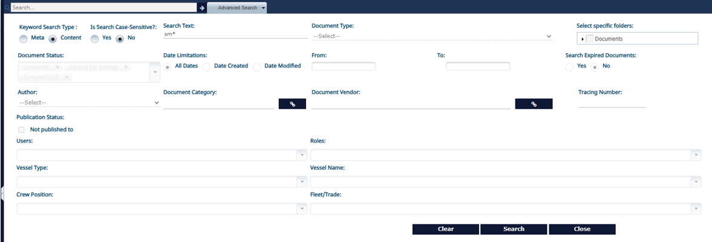

### DMS - Content Search Improvements

The **DMS Content Search** has been enhanced with advanced capabilities to improve accuracy and flexibility, including:

- Content search using wildcard characters.

- Case-sensitive and case-insensitive search options.

- Exact phrase search when the search text is enclosed in quotes (\" \").

- Ability to search within non-textual documents, supporting formats such as **HTML**, **XML**, **CSV**, **TXT**, **DOC**, **DOCX**, **XLS**, **XLSX**, **PPT**, **PPTX**, **ODT**, **ODS**, **ODP**, **PDF**, **RTF**, and **MBOX**.

  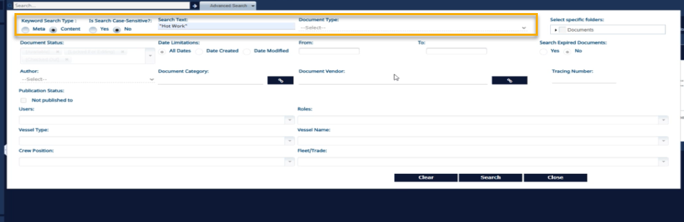

## Maintenance and Purchasing Manager

The following updates have been made to the *Maintenance and Purchasing* module. Access this module by selecting the **Maintenance and Purchasing Manager** tab from the top menu.

### Validate Budget Display in All Financial Reports

Budget changes are now accurately reflected in the **Fleet Cost Summary by Account**, **Ship Cost Summary by Account**, **Ship Actual Cost Details**, **Ship Cost Details by Account** reports, as well as in gadgets at both the ship and fleet levels.

### Check Budget Calculation in Budget vs Committed Cost Gadget
Budget changes are now reflected in reports and gadgets at both the ship and fleet levels.

### Calculation Fix for View Budget in Purchasing Documents

The *View Budget* screen has been improved to ensure accurate calculation of committed cost for miscellaneous invoices containing items assigned to different accounts. This enhancement resolves earlier discrepancies and now provides correct cost calculations across all relevant scenarios.

### Calculation Fix for Budget in Approval of Purchasing Documents

The document approval process has been enhanced to ensure accurate budget validation, with calculated values now aligning correctly with those displayed in the budget view. The workflow progresses as expected, displaying appropriate warnings for over-budget scenarios based on precise budget calculations. This update applies to **REQ** review, **RFQ**, and **PO** approval stages. Additionally, replication impact has been reviewed to ensure consistency and data integrity across systems.

For reference, refer to ticket number--- **ABS-034779**

### Budget - Committed Cost Calculation

The following enhancements improve cost calculation, readability, and requisition handling to ensure accurate reporting and streamlined processes.

- **Budget vs. Committed Cost Calculation**: Enhanced the calculation logic to ensure accurate cost reporting in scenarios where miscellaneous invoices include items linked to multiple accounts and ships. This resolves inconsistencies in the previous **Budget vs. Committed Cost Calculation**.

- **Improved Readability of Committed Cost Figures**: Committed cost values are now displayed in **white bold font** to improve visibility, especially in overbudget scenarios.

- **Enhanced RFQ Creation from Requisition -- Account Information Handling**: Improved the logic to ensure **Account**, **Cost Center**, and **WBS** values are properly carried forward when creating **RFQ** items from a requisition.

  - If requisition items are missing these values, they are now inherited from the requisition header.

  - If the header also lacks them, values are automatically inherited from the associated equipment.

  - This enhancement is also applied when generating a **Service Purchase (SP)** from a requisition.

For reference, refer to ticket number--- **ABS-005597**, **ABS-005722**, **ABS-024355**, **ABS-027536**, **ABS-024346**, **ABS-024635**, **ABS-024817**, **ABS-025100**, **ABS-025095**, **ABS-024946**, **ABS-024654**, **ABS-034779**, **ABS-034890**, **ABS-030186**, **ABS-036060**, **ABS-014494**, **ABS-002119**, **ABS-024796**

### Work Order Deferral Reason Index Term Enhancement

The Nautical Systems (NS) has been enhanced to include a **Work Order Deferral Index Term**, which can be used during the submission of work order deferrals.

Indexing the deferral workflow helps identify why the deferral request has been made. The index term is available in work order search, allowing users to easily locate work orders that have one or more deferral cycles associated with the selected reason. This improves traceability and supports more effective reporting.

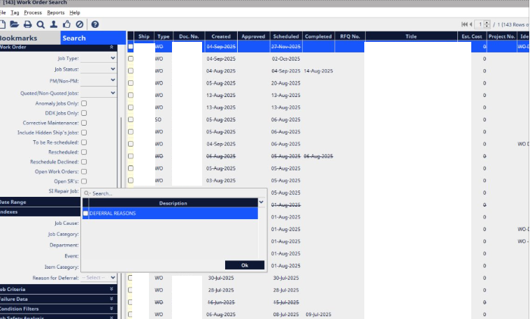

### Improvements to Work Order Deferral Plan

The Nautical Systems (NS) has been enhanced to support the retirement and hiding of **Work Order (WO) Deferral Plans**, similar to existing functionalities for purchasing approval plans such as **PO** and **RFQ**.

**Key Enhancements**:

- **Hide/Unhide WO Deferral Plans**

- **Retire WO Deferral Approval Plans**

  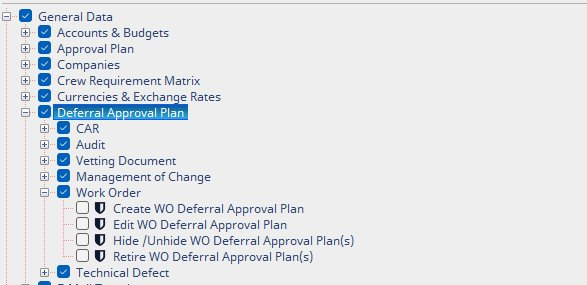

**Plan Effectiveness**:

- Users can now assign effectiveness to **Work Order Deferral Plans**, enabling better control and tracking.

- Any **WO Deferral Plan** that is hidden or retired will be excluded from the submission process, ensuring only active and visible plans are considered.

For reference, refer to ticket number--- **ABS-030600**

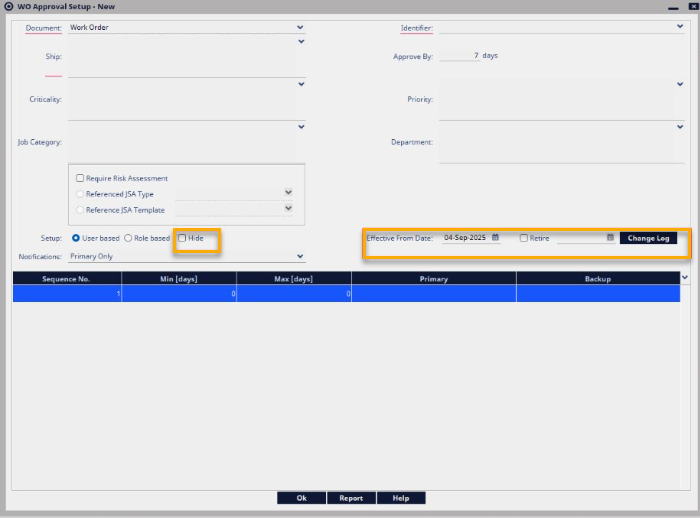

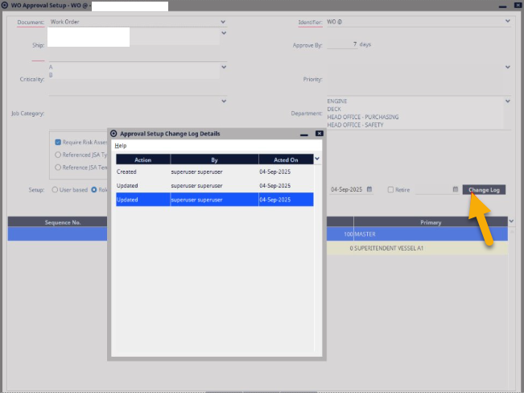

### Standard Job and Work Order Display Logic in Maintenance Time Plan

A new configuration has been introduced: **Display only the deferred instance of the planned maintenance job**.

When this system preference is set to **Yes**:

- The **Maintenance Time Plan** excludes intermediate scheduled jobs and displays only the deferred instance until its scheduled date.

- During the submission of a new schedule date in the *Work Order Deferral* screen, the system indicates the number of skipped scheduled instances, providing better visibility and control over deferred maintenance activities.

For reference, refer to ticket number--- **ABS-026030**, **ABS-024173**, **ABS-017106**, **ABS-004152**, **ABS-025324**

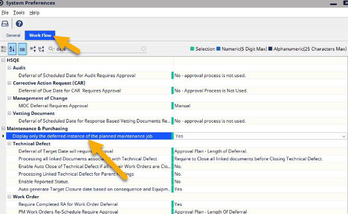

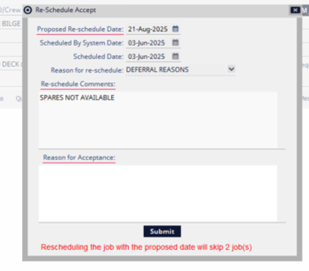

### Progress Bar Introduction to Indicate Ongoing WO Cancellation Process

When cancelling a work order from the *Work Order Search* screen, the process could take time due to multiple background processes. A progress bar has now been introduced to provide real-time visual feedback, indicating that the cancellation process is ongoing.

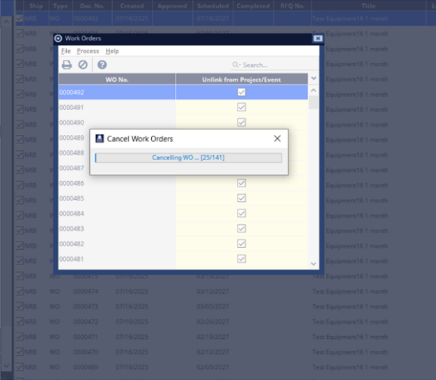

### Correct Display of On Order Quantity in Work Order/Explorer

Previously, the **On-Order** quantity displayed in both the **Work Order** hierarchy and the **Work Order Usage** tab was not calculated consistently. The discrepancy in calculation logic led to inaccuracies that impacted the overall purchasing process. To address this issue, a new system preference has been introduced:

- System Preference: **On-Order Quantity based on**

Options include:

- **Only Issued PO less Delivered Qty (default)**

- **Include REQ/RFQ and Issued PO less delivered Qty**

Additionally, the **On-Order** quantity calculation now excludes cancelled and rejected items/documents to ensure more accurate reporting.

For reference, refer to ticket number--- **ABS-031937**, **ABS-032607**, **ABS-022662**, **ABS-024585**, **ABS-024903**, **ABS-034844**

[]{#_Inventory_Cost_Analysis .anchor}

### Inventory Cost Analysis Report

Two new enhancements have been made to improve the generation and display of inventory cost data. These enhancements are as follows:

- **New Inventory Cost Analysis Report**: A new **Inventory Cost Analysis** report has been introduced in NS. This **SOX**-compliant report provides detailed calculations of inventory value based on either **FIFO** or **LIFO** methodology. This report is available at both **Fleet** and **Ship** levels under **Tools**--- **Export**.

- **Inventory Cost Regeneration and Filtering Enhancements**: An option has been added to regenerate inventory cost data directly from the *Part* screen. At the **Fleet** level, a new **Ship Selection** filter allows users to filter inventory cost data by **Line of Business (LOB)**, **Ship Fleet**, **Trade**, or **Individual Ship**. Additionally, at the **Ship** level, a new checkbox option **Include Sub Equipment** has been introduced to ensure that the cost of all parts associated with the selected equipment is accurately calculated.

For reference, refer to ticket number--- **ABS-037338**, **ABS-016668**

### Performance Improvement for Inventory Cost Analysis

To improve efficiency, performance enhancements have been implemented in the **Inventory Cost Analysis Report**. Previously, users experienced delays when exporting data at the **Fleet** level across the complete equipment hierarchy. With this update, export performance and responsiveness have been significantly optimized.

### Excel Format-Inventory Cost Analysis

The **Inventory Cost Analysis Report** is now available in Excel format with a collapsible hierarchical structure, providing improved clarity and easier navigation. The report data is structured as follows: **Ship**--- **Equipment**--- **Part**.

This format enables users to expand or collapse sections to view cost details at various levels, making it easier to analyze inventory costs across different components.

### Inventory - Create/Edit Stock Reconciliation

As part of the stabilization effort, multiple issues related to inventory functionality have been identified, addressed, and resolved. These enhancements improve the system's reliability, accuracy, and usability across inventory operations, stock reconciliation, part imports, delivery processing, and reporting.

**Key Enhancements**:

- **Create/Edit Stock Reconciliation**: Users without the **Create/Edit Stock Reconciliation** authorization can longer link location or inventory values to parts from the **Work Order Usage** tab. This action now requires proper authorization.

- **Parts/Consumables**: Resolved an issue where the load sheet containing special characters prevented successful import of **Parts** and **Consumables**.

- **Spares List By Location** report: Corrected the incorrect total displayed on the **REQ/PO** summary section.

- **PO Delivery and Equipment Location Preference**:

  - An issue was identified where, even when a part had a location linked and the system preference **Use default equipment location for delivery** was enabled, the system was incorrectly using the equipment's default location during **PO** delivery instead of the part-linked location. This has been resolved to ensure that the part-linked location takes precedence.

  - Additionally, to improve clarity, the system preference **Use default equipment location for delivery** has been renamed to: **PO delivery to use Equipment Location for Parts without Location**.

- **Shipping Document Date**: Resolved an application crash caused by missing **Shipping Document Date** during PO delivery.

- **Location Interchangeability Display**: Corrected a display issue in the **Machinery Explorer** where importing interchangeable parts with the same location, displayed multiple locations.

- **Spares List By Equipment Report**: Resolved report issue caused by multiple duplicate parts due to cross-referencing which previously rendered the report unusable.

- **Inventory Replenishment**: Corrected an issue in the preview report for interchangeable parts in the **Inventory replenishment** function.

- **Quantity Reconciliation**: Addressed an issue where entering the quantity for reconciliation in the lower pane was not accepted unless the user tabbed out of the field.

- **Duplicate Column Import**: Corrected an issue caused by importing **Parts/Consumables** with duplicate values in the **PTNOREF**, **PTNOREF2**, **PTNOREF3**, and **PTNOREF4** columns.

- **Transfer Order for Multiple-Location Parts**: Resolved an issue where the system did not prompt the user to select the correct source location when creating **TOs** for parts with both single and multiple locations.

- **MySQL Search**: Improved performance for keyword searches in the *MYSQL* database, addressing slow response times.

- **\[Mobile\] Automation API**: Corrected an issue where the mobile automation API failed to fetch the correct inventory for interchangeable parts.

  - **Reports**: For the **Parts Manual By Equipment - Standard Format** and **Spares List by Equipment** reports, users observed that the **Serialized Items** were not being filtered by the item category. This issue has been resolved.

For reference, refer to ticket number--- **ABS-012665**, **ABS-031813**, **ABS-002959**, **ABS-012717**, **ABS-025950**, **ABS-028484**, **ABS-034652**, **ABS-035256**, **ABS-022902**, **ABS-024990**, **ABS-024394**, **ABS-033726**, **ABS-034035**, **ABS-036181**, **ABS-036260**, **ABS-036306**, **ABS-036311**, **ABS-017425**, **ABS-036556**

### Inventory Data Integrity

This release includes several enhancements to improve consistency, accuracy, and reliability within the inventory management functionality, specifically related to inventory ledger and cost data handling.

**Key Enhancements**:

- **Dangling Transactions Isolation**: Isolated Inventory transactions that were inconsistent or loosely linked to active records have been identified and separated. This ensures that vessel inventory data remains accurate and aligned with expected operational metrics.

- **Redundant Data Persistence Removed**: Eliminated unnecessary data that was previously being stored during inventory transactions, which had led to processing failures. This redundant information is no longer persisted, resulting in more efficient data storage and improved system performance.

- **Data Loss Prevention During Inventory Load**: An issue where site-level inventory data was at risk of being lost during loading has been identified and addressed. The enhanced mechanism now ensures complete and reliable data capture across all inventory load processes.

These improvements significantly strengthen the system's ability to manage inventory data accurately and efficiently, leading to better operational reporting, cleaner data, and improved system stability.

For reference, refer to ticket number--- **ABS-033942**, **ABS-011089**, **ABS-032133**, **ABS-027769**, **ABS-030013**

### Auto Data Correction - Improve Automatic Data Correction Mechanism

The Nautical Systems includes an automatic data correction mechanism that initiates when information required at a site is not available. In such cases, the system triggers a request to retrieve the missing information from the originating site.

**Enhancement details**:

- Previously, when such requests were initiated, the system attempted to generate a pending transaction log for further processing. However, due to an internal error, this log was not consistently created, causing the auto-request mechanism to fail. This issue has been identified and resolved.

- Additionally, when part-related information was requested, some newly added tables were not included in the transaction group, resulting in incomplete data being transmitted.

- The auto-correction logic has been extended to cover all relevant and related tables for the requested concept. Now, once a request is triggered, the system ensures complete and consistent transmission of all associated information to the requesting site.

For reference, refer to ticket number--- **ABS-013628**

### Slowness - Requisition Creation with 100+ Items for Provisions

A performance improvement has been made when adding **100+** items in a **Requisition**. The process has been optimized to ensure faster and smoother handling of large entries.

For reference, refer to ticket number--- **ABS-034955**

### REQ - Type-In Item Deletion on Review

The logic for the **Add to Hierarchy** checkbox has been enhanced to ensure that type-in items with the same or different descriptions are treated as separate entries when added and reviewed. This prevents unintended merging of items into a single record, improving accuracy and control in hierarchy creation.

For reference, refer to ticket number--- **ABS-036541**, **ABS-036796**, **ABS-037685**, **ABS-038043**

### Accruals Export via API does not Read XLST Formatter

The accruals export process via **API** has been enhanced to support *XSLT* formatters. Previously, when executing the accruals export through an **API** call, the system was not reading the *XSLT* formatters, which prevented the generation of formatted output. This functionality has now been corrected and enabled for consistent export formatting.

For reference, refer to ticket number--- **ABS-036114**

### Adding Enable/Disable Functionality Based on Conditions on UI Selection

Rule support has been added to enable dynamic UI behavior in the **Custom Report Web Framework**.

Newly Supported Rules:

- **hideField** -- Hides a specified field

- **unHideField** -- Unhides a hidden field

- **enableField** -- Enables a disabled field

- **disableField** -- Disables a field

- **makeFieldRequired** -- Marks a field as required

- **makeFieldOptional** -- Marks a field as optional

### New Identities for Ship Type

Nautical Systems has been enhanced with eight new ship type identities to improve classification, traceability, and reporting capabilities.

Newly Added Ship Type Identities:

- **Non Ship Structure**

- **Offshore**

- **Fishing**

- **Dry Cargo / Passenger**

- **Non Merchant**

- **Non Propelled**

- **Non Seagoing Merchant Ships**

- **Miscellaneous**

These additions enable more accurate categorization of vessels and support more effective compliance and operational reporting across the system.

### Approval Plan Related Corrections

The following enhancements have been made to improve approval handling and workflow updates in **PO** and **RFQ** processes.

When a **Purchase Order (PO)** exceeds the budget and reaches the nth level of approval, users previously encountered issues proceeding due to the need for an **n+1** level override. This has now been enhanced as follows:

- NS now displays a list of roles with budget override authorization at the approval stage.

- Users can select a role, enabling an authorized user to approve the over-budget PO.

- If no authorized user is found for the selected role, the system prompts the user accordingly.

- This enhancement applies to both **Approval Set up-One Stage Automated** and **Approval Chain Automated** setups, including user-based and role-based approval configurations.

- If the designated user has override authorization but the PO is over budget, the system will now correctly move the PO to the next **(n+1)** level.

When approving multiple POs from the search list, the wizard page now correctly displays the **Action** and **Approver** columns for each PO in the list, ensuring better visibility and accuracy during approval. Additionally, an issue where the identifier was not displayed after submitting the **RFQ**-to-**PO** creation wizard has been resolved.

**Note:**

This issue was specifically observed in **Role-based Approval** setups.

When **RFQ** or **PO** approval plans are updated, the system now dynamically updates the **RFQ/PO** linked to this plan that are still in process. The following logic is applied:

- If the primary user is updated and is out of office, the document is updated with the backup user.

- If the primary user is updated and is not out of office, the document is updated with the primary user.

- If the backup user is updated and the primary user is not out of office, then the primary user is retained.

- If the backup user is updated and the primary user is out of office, the backup user is assigned.

The same fix logic has also been applied to the mobile application, ensuring consistency across platforms.

For reference, refer to ticket number--- **ABS-031995**, **ABS-021895**, **ABS-034101**, **ABS-024645**

### eProcurement - Implement Punchout Integration

The Nautical Systems application has been enhanced to support **Punchout integration with ShipServ**, enabling an efficient and streamlined procurement experience. This integration allows buyers to select items directly from the **ShipServ** vendor portal and transmit them as **Draft Purchase Orders** into Nautical Systems via *API*. These draft orders can be reviewed, validated, and finalized into official **Purchase Orders (POs)** within Nautical Systems.

**Key Features**:

- **Draft Order API Integration**: **Draft Orders** are now directly imported from **ShipServ** into Nautical Systems through *API* integration.

- **Draft PO Screen & Search**: A new user interface has been introduced to view, manage, and search **Draft Purchase Orders** effectively.

- **PO Creation from Drafts**: **Draft POs** can be converted smoothly into official **POs** through a streamlined process.

- **Bidirectional Navigation**: Users can easily switch between **Draft POs** and finalized **POs** for tracking and reference purposes.

- **Enhanced PO Search**: Improved search capabilities allows users to quickly locate **POs** that originated from **Draft Orders**.

- **ShipServ PO XML Enhancements**: The following *XML* tag enhancements have been introduced:

- *\<ExternalID\>* tag at the PO level

- *\<ExternalID\>* and *\<AuxillaryExternalID\>* tags at the item level

- *\<POType\>* tag now displays **Draft** for **POs** created from **Draft Orders**.

  - **Field Restrictions**: To ensure data integrity, cost-related fields, service menus, and material menus are disabled in POs created from **Drafts**.

**Buyer Benefits**:

- **Better Pricing**: Leverages collective purchasing power through **ShipServ** for more competitive pricing.

- **Faster Procurement**: Eliminates the need for manual **Requisition** and **RFQ** steps.

**Lower Maintenance**: Enables direct procurement of **Punchout** items and allows frequently used items to be easily added to Nautical Systems.

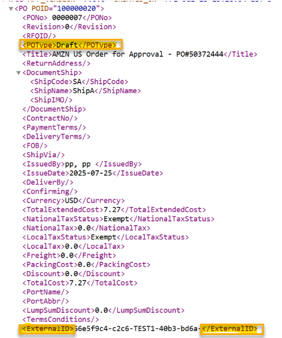

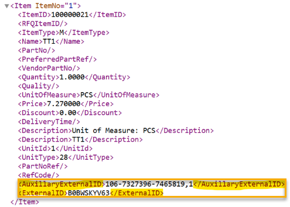

## Database Creation

The following updates have been made to the **Overall System**.

### DB Cut Fix for External Link Tables

The database cut process has been enhanced to ensure inclusion of **External Link**-related information, which was previously missing.

### Cleanup Attachment After DB Cut

The database cut process has been enhanced to ensure automatic cleanup of temporary files generated for attachments, which was previously not deleted.

### DB Creation Filtration

The database cut process has been enhanced to include **Shipping Manifest Trail** and **Personal Payment Schedule** information, which was previously missing.

### DB Creation and Load

Multiple issues related to database (DB) cut and load processes have been addressed as part of the stabilization improvements. The following fixes have been implemented:

- Attachments were being generated as **0KB** files when the attachment type was set to a value other than **PRODUCTION**. This issue has been resolved.

- Files were being incorrectly removed during the DB cut process. This issue has been resolved by appending the site abbreviation to the selected folder name, ensuring proper file handling during creation.

- *MYSQL* parameter check: If the *MYSQL* parameter *treatMysqlDatetimeAsTimestamp=true* is missing, the system previously failed during DB cut and other application processes. The application now checks for this parameter at login and notifies the user if it is missing, thereby preventing potential application errors.

- **Work Order** inserts were failing during **DB** cut when the associated **Standard Job** did not have a linked ship. This issue has been resolved.

- The **CBM_REPORT** table was being filtered by ship during replication, but not during database creation, leading to inconsistencies. This issue has been resolved to ensure consistent ship-based filtering across both processes.

For reference, refer to ticket number--- **ABS-024972**, **ABS-031726**, **ABS-032637**, **ABS-011057**, **ABS-011058**, **ABS-022245**, **ABS-029152**

## Replication Manager

The following updates have been made to the *Replication Manager* module. Access this module by selecting the **Replication Manager** tab from the top menu.

### Fix Tables Unable to be Created as Dummy Record in Replication

In certain cases, the system was unable to create on-the-fly (dummy) records during replication due to table definition constraints. This mechanism has been improved, and the following tables have been updated to support record creation during replication:

- **CREW_POSITION_TITLE**

- **DEDUCTION**

- **EARNING_TYPE**

- **FAILURE_MODES**

- **LU_ACTIVITY**

- **LU_QUALIFICATION**

- **MODULE**

- **PJC**

- **POTENTIAL_STRUCTURE_LIST**

- **SHIP**

- **TABLE_TEMPLATE**

### Handle Not Nullable STRING Fields

During dummy record creation, failures occurred when a table contained non-primary key, non-nullable string-type columns without default values configured. With the code changes introduced, such failures are now prevented if a default value is defined in the **record-default.definition** properties file.

### Attachment Clean-up During DB Creation Process

Nautical Systems has been enhanced to improve the remote database creation process. As part of this enhancement, attachments located in the user\'s home directory are now deleted during the operation.

For reference, refer to ticket number--- **ABS-025011**, **ABS-022239**, **ABS-025155**, **ABS-025154**

### Implementation: Configure Foreign Keys

During replication load, if the required data was not available at the loading site and the system could not create a dummy record, the transaction would fail previously. To address this issue, the system now supports optional foreign keys. It retrieves the list of **table.column** values from the configuration file: *conf/column-config-optional.definition.*

If any column listed in this file references a missing optional foreign key, the systems populates a null value instead of failing the transaction. This enhancement improves replication stability and ensures smoother data synchronization.

### Ensure Critical Reference Data is Successfully Created in Replication

Replication logic has been enhanced to ensure accurate handling and correction of critical reference data items, including:

- **APP_USER**

- **SITE_ADMINISTRATION**

- **INDEX_TYPE/INDEX_TERM**

- **LOOKUP_TYPE/LOOKUP_VALUE**

- **SHIP**

Additionally, ship-level filtering is now supported for project data replication. Any exceptions related to project data are now successfully handled, ensuring improved consistency and data integrity during synchronization.

For reference, refer to ticket number--- **ABS-007691**, **ABS-033271**

### ASSET Related Trigger Issue and Its Alternative

Enhancements have been made to handle replication and **DB Cut** processes related to the **ASSET** tables used in serialized items. These enhancements ensure that related issues are gracefully handled and do not disrupt operations.

**Note:**

These fixes are applicable for sites running version **7.0.0** and above.

### Ensure Proper Filtering for Concepts

The **Replication Filtration** logic has been reviewed and enhanced to ensure consistency in replicated data. It has now been aligned with the DB creation logic to maintain uniformity.

Additionally, users observed that when machinery data was created using the **Copy Ship Material Classification** option, the **cross-referencing** tag was being generated incorrectly. This issue has been resolved.

Discrepancies during **DB Cut/Replication** involving the following tables were also identified and fixed:

- Budget related Information

- Vessel Certificate-related Information

- Mooring Line-related Information

- Text data

- Reconciliation Item-related Information

For reference, refer to ticket number--- **ABS-029409**, **ABS-034005**, **ABS-034988**

### Improve Existing Record Locking Management

Nautical Systems has been enhanced with additional gate checks to improve data integrity. When an application lock on a screen is forcibly removed, users are now warned about potential concurrent data writes. This measure helps reduce the risk of data overwrites if locks are manually bypassed.

### Replication Load Update Translate to Insert

The replication process has been enhanced to handle scenarios when an **UPDATE** is received for a record that does not exist in the target system.

Instead of rejecting the update and requesting the record, the system will now:

- Create a dummy record on the fly, and

- Generate a request transaction to fetch the complete data.

This allows replication to proceed with the update and ensures that the rest of the transaction group continues without interruption.

### Improve Foreign Key Management to Avoid Failures

The replication process has been enhanced to address data inconsistencies caused by foreign key failures. Previously, all foreign key constraints were treated uniformly, which could lead to large-scale data loss when optional references failed. While some foreign keys are critical for record creation (e.g., a **DOCUMENT_ITEM** must link to a **DOCUMENT**), others are non-essential and can be corrected later.

**Enhancement Details**:

- The system now distinguishes between mandatory and optional foreign keys.

- For optional references that do not exist and cannot be created immediately, the system sets the foreign key value to **NULL**.

- This allows dummy records to be created without interrupting the transaction group, thereby preventing unnecessary replication failures.

**Note:**

This feature can be disabled by using the **VM** prop: *ns.replication.optional.keys= false.*

This enhancement improves data resilience and significantly reduces the risk of large-scale data inconsistencies. Additionally, the system supports optional foreign key definitions through a configuration file. The list of optional **table.column** values is retrieved from: *conf/column-config-optional.definition*.

- If any column listed in this file references a missing optional foreign key, a **NULL** value is populated instead of failing the transaction.

This enhancement improves replication stability and ensures smoother data synchronization.

### Ship-finder Query Related to RECONCILIATION_ITEM

**Reconciliation** items now replicate correctly and match the database structure, following the resolution of an issue where the correct ship was not being identified during replication.

## Voyage Manager

The following updates have been made to the *Voyage Manager* module. Access this module by selecting the **Voyage Manager** tab from the top menu.

### VM Performance Improvements

To improve the performance of **Voyage**, **Event** and **Project** document screens, metadata and reference data will now be cached at the screen level going forward.

### Improvements to Meet COTS/STIG Standards and Strengthen Data Security

To ensure full compliance with **COTS/STIG** standards and to strengthen data security, the system has been enhanced with the following updates:

- **Encrypted Password Transmission**: The application now transmits only cryptographically protected passwords across user interfaces, including the user screen and account settings.

- **Masked User PIN**: **User PINs** will no longer be displayed in user screens or account settings. They are now masked in the same manner as passwords to prevent unauthorized visibility.

- **Secure Configuration Files**: Passwords have been removed from property files and are now securely encrypted, reducing the risk of exposure through configuration settings.

These improvements reinforce the system's commitment to secure data handling and compliance with industry-standard security protocols.

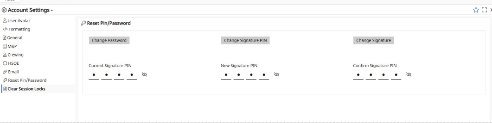

### Multiple Tabs Support for Voyage Manager

The **Voyage Manager** module for Nautical Systems has been enhanced to support smooth access across multiple windows and tabs within the same browser session. Users can now operate in parallel browser views without needing to re-login, improving workflow efficiency and enhancing the overall user experience.

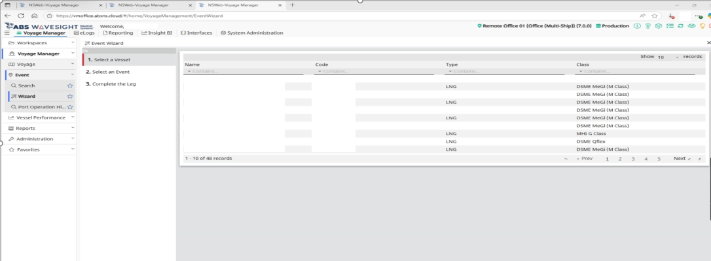

### Energy Efficiency Section in MRV Screen

An **Energy Efficiency** section has been added to the *MRV* screen. It provides the following calculations based on the given formulas:

- **Fuel Consumption by Distance (kg)**: (Total Fuel Consumption \* Conversion Factor to kg) / Total Distance Travelled (NM)

- **Fuel Consumption by Transport Work (gms)**: (Total Fuel Consumption \* Conversion Factor to grams) / Transport Work

- **CO2 Emission by Distance (kg)**: (Total CO2 Emission \* Conversion Factor to kg) / Total Distance Travelled (NM)

- **CO2 Emission by Transport Work (gms)**: (Total CO2 Emission \* Conversion Factor to grams) / Transport Work

For reference, refer to ticket number--- **ABS-034784**

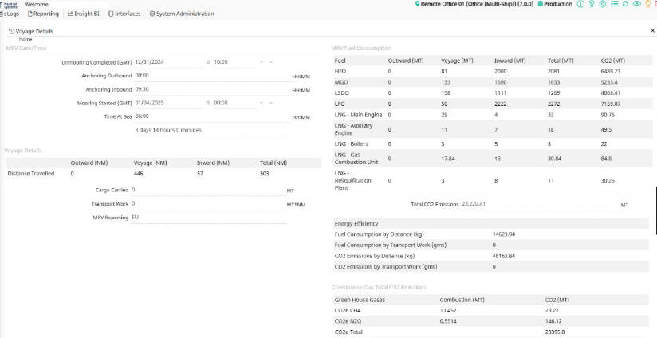

### Vessel Schedule Section - Introduce Spinner to Indicate Data Retrieval

To improve user experience and provide visual feedback during data retrieval, a loading indicator has been added to the **Vessel Schedule Grid**.

### For ROB Values are Brought Forward from First Voyage Event of the Calendar Year

This enhancement improves the accuracy of fuel data in the **IMO DCS** report by introducing logic to calculate and display **Brought Forward Fuel Remaining On Board (ROB)** values for each ship.

When generating the **IMO DCS** report for a selected ship, the **Brought Forward Fuel ROBs** are now calculated based on the first event's end date within the selected reporting year.

### Non Steaming Tab for IMO DCS Report for LNG Voyages

For **LNG** voyages, the **Port** value in the report is now accurately derived from the **Port Operation Event Summary** section.

- **End of Sea Passage (EOSP)** is mapped to the **Start of Port Operation**.

- **First Arrival at Operational Sea Port (FAOSP)** is mapped to the **End of Port Operation**.

This enhancement ensures consistency between voyage event data and port operation summaries, thereby improving the reliability of **LNG** voyage reporting.

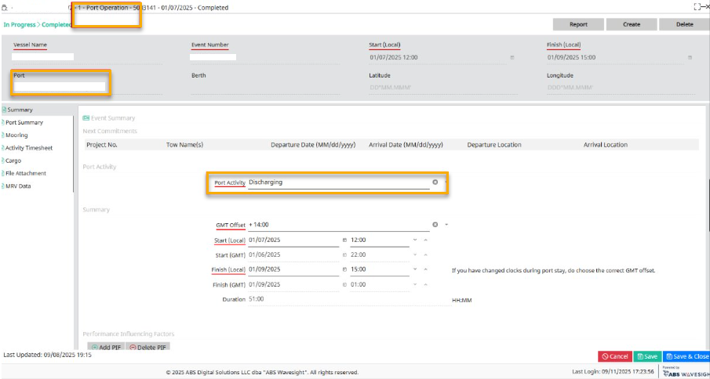

### Changes in VM to Support IMO DCS

Nautical Systems has been enhanced to support various **IMO DCS** requirements.

Since **IMO DCS** is a yearly report, users can now select the year for generating the **IMO DCS Report** instead of selecting individual months.

Going forward, in the **Bunkers** section of the report at **year-end (EOY):**

- The **ROB** values will be picked up from the last voyage of the ship in the selected year.

- **Time at Sea** and **Observed Distance** have been reviewed to ensure they are displayed correctly in the *Annual Summary* screen.

  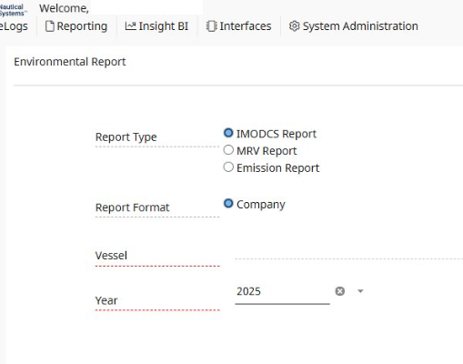

### Add Document Type Field to File Attachment Section of Voyage Event Document

Users can now select and save a **Document Type** when uploading files in the **File Attachment** section of a voyage event document. This enhancement improves document classification and retrieval.

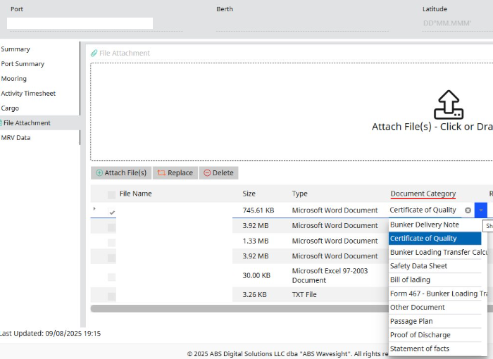

## Utilities

Several new utilities have been introduced to help diagnose and resolve common issues more efficiently. These tools are intended to be used in collaboration with Nautical Systems Technical Support. For the best experience, it is strongly recommended not to attempt running these utilities on your own.

Rather, should you require assistance, please contact [Technical Support](https://abssupport.powerappsportals.com/SignIn?ReturnUrl=%2Fknowledgebase%2F) to submit a ticket. A member of our technical team will follow up and provide step-by-step guidance throughout the process to ensure the best results.

### WO - Data Integrity By Status

To address potential inconsistencies in the last status field of Work orders (WOs), Nautical Systems (NS) introduces a new utility that ensures better data integrity across core modules. The system relies heavily on the last status of a document for search filters, enabling/disabling UIs, processing validations, and scheduling calculations. Therefore, maintaining the integrity of this field is critical for system stability and the accurate display of maintenance schedules.

Nautical Systems may occasionally encounter in the key field last status of Work Orders due to various reasons. To address this, the utility named *StatusCorrection.exe* is now available under the **Samples**--- **StatusCorrectionUtility** folder. This tool enables detection of inconsistencies and automatic correction of incorrect values in PO documents.

Key Features

- This utility can be run individually for:

    - A set of given documents using document number(s), or

    - WOs created within a specific date range.

- Detects last status inconsistencies and corrects them for a **Work Order** document.

- Auto-correction can be run to correct the last status.

- Starting from version **7.0.0**, this function runs automatically during replication.

**Notification Support**

- A notification mechanism is available:

  - Sends alerts via both NS message and email to subscribed users.

  - Requires the user to enable the **Notify on WO Auto Correct** check box located at: **User Screen**--- **Notification** tab--- **Maintenance Notification** section.

For reference, refer to ticket number--- **ABS-031467**, **ABS-027738**, **ABS-031708**, **ABS-037022**, **ABS-036797**

### PO - Data Integrity By Status

To address potential inconsistencies in the last status field of **Purchase Orders (POs)**, Nautical Systems introduces a new utility that ensures better data integrity across modules. The system relies heavily on the last status of a document for search filters, enabling/disabling UIs, processing validations, and other functions. Therefore, maintaining the integrity of this field is critical for system stability and the accurate display/processing of **POs**.

NS may occasionally encounter mismatches in the key field last status of **Purchase Orders** due to various reasons. To address this, the utility named *StatusCorrection.exe* is now available under the **Samples**--- **StatusCorrectionUtility** folder. This tool enables detection of inconsistencies and automatic correction of incorrect values in PO documents.

Key Features

- This utility can be run individually for:

  - A set of given documents using document number(s), or

  - POs created within a specific date range.

- Detects last status inconsistencies and corrects them for a **Purchase Order** document.

- Auto-correction can be run to correct the last status.

- Starting from version **7.0.0**, this function runs automatically during replication.

**Notification Support**

- A notification mechanism is available:

  - Sends alerts via both NS message and email to subscribed users.

  - Requires the user to enable the **Notify on PO Auto Correct** check box located at: **User Screen**--- **Notification** tab--- **Purchasing Notification** section.

For reference, refer to ticket number--- **ABS-025718**, **ABS-025697**, **ABS-023793**

### Total Invoiced & Issued Qty in PO to be Calculated via Utility

A new utility has been introduced in Nautical Systems to detect and correct data discrepancies in key calculated quantity fields---**Issued**, **Received**, **Delivered** and **Invoiced Quantity**---within **Purchase Orders (PO)** documents. These inconsistencies may arise due to various reasons and could impact validations and searches throughout the purchasing workflow.

To address this, the utility named *PORcptDlvInvcIssuedQtyCorrection.exe* is now available under the **Samples**--- **QuantityCorrectionUtilities** folder. This tool enables detection of inconsistencies and automatic correction of incorrect values in PO documents.

**Key Features**

- Detects and corrects inconsistencies in **Issued**, **Received**, **Delivered**, and **Invoiced Quantity** fields in PO documents.

- Supports execution for a specific set of document numbers or a defined **PO Fiscal Effective** date range.

- Allows recalculation of each quantity type individually based on the parameters passed.

**\**

**Auto-Correction Mechanism**

Starting from version **7.0.0**, the auto-correction mechanism for **Received**, **Delivered**, and **Invoiced Quantity** is triggered automatically during:

- Receipt/Delivery from PO

- Invoice creation/cancellation via UI

- Import operations

- Replication processes

**Note:**

The detection and correction of **Issued Quantity** can only be performed via the utility.

For reference, refer to ticket number--- **ABS-013628**, **ABS-036750**, **ABS-036731**, **ABS-007793**

### Purchase Order Data Integrity

Nautical Systems (NS) has introduced an enhancement to address data mismatches in the key field, specifically the current revision ID of a **Purchase Order**, which may occur due to various reasons.

The current revision ID plays a critical role in tracking the latest revision of a **Purchase Order** and is referenced in several stages of the purchasing cycle, including search, processing, and cost calculation.

To mitigate this, a correction utility named *PORevisionCorrectionUtility.exe* has been introduced and is available under the **Samples**--- **PORevisionCorrectionUtility** folder.

**Enhancement Features**:

- This utility can be executed manually for a specific set of documents by providing the document number(s).

- It detects inconsistencies in the current revision ID and corrects them for the affected purchase orders.

- This auto-correction process is triggered through the utility and must be executed separately.

This enhancement ensures better data integrity and minimizes disruptions caused by revision ID mismatches in the **Purchase Order** workflow.

For reference, refer to ticket number--- **ABS-014765**, **ABS-028732**, **ABS-033323**, **ABS-033793**

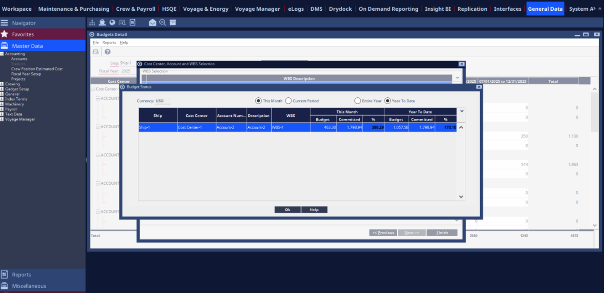

### Inventory Data Issues Detection and Correction Tool

The *InventoryDataApp* utility has been introduced to detect and correct error conditions related to inventory transaction data. When the proper value can be determined, corrections are applied automatically. In cases where no definite result is possible or have an inclusive result then, the system flags the data validation failure and provides the necessary information for review.

# Mobile Apps

### Capacitor, Nrwl to Nx and Other Peer Dependencies Upgrades

NS-Mobile has been updated to **Angular 17**, **Capacitor 7**, **NGRX 17**, and other peer dependencies. As part of this update, the workspace has been migrated from Nrwl to the latest Nx framework, improving maintainability and build performance.

### Enhance Equipment Screen to Add Created Date and Retired Date

NS has been enhanced to include two new fields: **Created Date** and **Retired Date**. A validation rule ensures that, if both dates are provided, the **Created Date** must always be earlier than the **Retired Date**.

### Equipment Job History Rich Text Fields Related Updates

Performance-related updates have been applied to the **Equipment Job History** feature in NS Mobile applications, enabling faster and more efficient access.

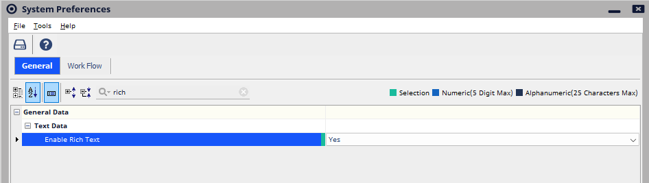

### Performance Improvements to Rich Texts Fields

To enhance mobile performance, the **NS Vessel**, **NS Workboat**, and **NS Drydock** applications now store rich text fields (such as **Description** and **Findings** in **Work Orders**, **Inspections**, **Meetings** and **Drill/Audit** documents) in a dedicated *CouchDB* database. This design improvement enables more efficient data management on mobile devices.

Additionally, for equipment job history, rich text fields will now be available in **offline** mode only if the corresponding Work Order exists on the device. In **online** mode, full details will remain accessible.

These enhancements significantly reduce memory usage during synchronization and minimize application crashes, resulting in improved sync performance and greater stability across mobile platforms.

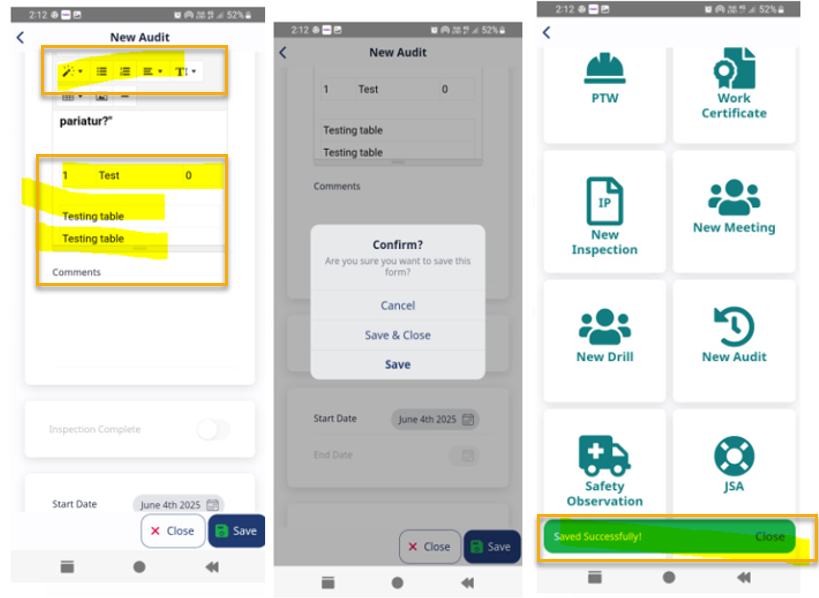

### Capacitor Version Upgrade to Support Latest SDK Requirements

The **Capacitor** framework has been upgraded to ensure compliance with the latest **SDK** requirements for both **Android** and **iOS** platforms.

# Bug Fixes

The following bug fixes were completed for this release.

## Document Manager

### DMS Fixes Related to Indexing

Users observed that indexing was not occurring automatically for documents when a remote site was created or during replication. This issue has been resolved. Going forward, indexing for **DMS** document content will be triggered automatically upon the following events:

- Upload of a new document

- Upload of a revised document

- Deletion of a document

- Replication of a document (indexing is updated on the remote site where the document is replicated)

- **DB Cut/Site Cut** (content index is included in the **DMS** document content repository for the cut site or is automatically generated on the first service start at the **Site Cut/DB Cut** deployment site).

- Mass upload of documents via Excel import (first-time **DMS** repository creation)

For reference, refer to ticket number--- **ABS-035063**

### DMS Synchronization Status Improvements

Users observed that **DMS Sync** status was not correctly displaying details for replicated sites and document statuses (namely, in sync, missing, mismatch) when using combined publishing/revoking criteria (**Vessel Name**, **Vessel Type**, **Fleet/Trade**). This issue has been resolved, and **DMS Sync** now accurately displays the replication and document status for all such combinations.

For reference, refer to ticket number--- **ABS-034696**

### Sites Information Screen Loading Performance Improvement

Users observed that the *Site Information* screen was taking a considerable amount of time to load and scroll through. The performance has been optimized, and the screen now loads and scrolls more quickly.

For reference, refer to ticket number--- **ABS-038333**

### DMS Not Syncing Between Vessel and Central Due to Version Number

Users observed that the system was unable to maintain document versions beyond **1.9**. This occurred because the library in use did not correctly handle versions **2.0** and above. This issue has been resolved.

For reference, refer to ticket number--- **ABS-036941**

## Maintenance and Purchasing Manager

### Role Based Work Order Deferral Issue from Work Order Search

Users observed that the role-based **Work Order** deferral accept flow was not functioning correctly from the *Work Order* search screen, and the decline flow was not working as expected from both the **Work Order UI** and the search screen. These issues have been resolved.

For reference, refer to ticket number--- **ABS-029496**

### Work Order Completion/Cancellation Status Impact on Standard Job

Users noticed an issue where canceling or completing a work order would incorrectly update the last due date of the **Standard Job**, which is **Completion** based, causing confusion. This issue has been resolved; if the **Standard Job is Completion Date**-based, the last due date will remain unchanged when a work order is completed or canceled.
For reference, refer to ticket number--- **ABS-015306, ABS-003105, ABS-025466**

### Work Order Icon Visibility

The **Work Order** **Create** icon has been enhanced to display correctly in dark mode across various modules in Nautical Systems, ensuring consistent visibility and user experience.

For reference, refer to ticket number--- **ABS-032083**, **ABS-033111**, **ABS-031003**, **ABS-032664**

### WO for Ship Can be Linked to Equipment or Standard Jobs

When linking **Equipment** to a **Work Order**, the selected ship was not consistently applied in the **Equipment Search**, allowing users to modify the ship and view or link equipment from other ships. Bookmarked equipment from unrelated ships could also display, leading to incorrect associations. This issue has been resolved--- the ship selected in the **Work Order** is now automatically transferred to the **Equipment Search** and is disabled to prevent modification. This ensures that only equipment and associated **Standard Jobs** from the selected ship can be linked. Additionally, when using bookmarks, only equipment from the selected ship will be displayed, regardless of whether the ship is included in the **Bookmark**.
For reference, refer to ticket number--- **ABS-026736**, **ABS-008160**

### Work Order Search - PM/Non-PM WO

Users noticed that the **PM** column in the Work Order search list was not displaying **Yes(Y)** after the associated **Standard Job** was deleted. This issue has been resolved, and the **PM** status correctly displays in the search results as expected.
For reference, refer to ticket number--- **ABS-003091**

### Unauthorized Users Able to Cancel Completed WO from WO Search

Users without the **Cancel Completed WO/No Action Job** authorization were able to cancel work orders in **Completed** or **Closed** status. This issue has been resolved.
Additionally, to improve clarity, the authorization **Cancel Completed WO/No Action Job** has been renamed to **Cancel Completed/Closed WO/No Action Job**.
For reference, refer to ticket number--- **ABS-033511**

### Work Order Cancellation Between Deferral Workflow

Users were able to cancel work orders that were in **Deferral Cycle**, which could result in status inconsistencies. This issue has been resolved to prevent cancellation during the deferred cycle and ensure consistent work order status handling.
For reference, refer to ticket number--- **ABS-025012**

### Work Order Wizard License Issue

Users observed that the system was encountering an exception and terminating when creating a **Work Order** through the **Work Order Wizard** in versions without a **DMS** license. This issue has been resolved, and **Work Orders** can now be created successfully without requiring a **DMS** license.
For reference, refer to ticket number--- **ABS-036453**

### Authorization not Working Correctly for REQ Association in WO

Users observed that without authorization to view requisitions, the system did not allow linking or unlinking of **Work Orders** in the **Related Work** tab of the **Work Order** document. This issue has been resolved.
For reference, refer to ticket number--- **ABS-032067**

### CM Type Related to Search for Work Order Search

Users observed that in **Work Order Search**, Work Orders were not being filtered correctly when using **CM** type filters. This issue has been resolved, and the filtering now works as expected.

### CM Vendor Related Search for Work Order Search

Users observed that in **Work Order Search**, the system was unable to filter **Condition Monitoring Work Orders** associated with **Condition Monitoring** analysts. This issue has been resolved, and the filtering now works as expected.

### Work Order Search Performance Improvement

Users observed that at the fleet level, **Work Order Search** was often freezing when performing **\*** searches or searches with job causes. This issue has been resolved, and searches now run smoothly without freezing.
For reference, refer to ticket number--- **ABS-036519, ABS-006445, ABS-034322, ABS-034524, ABS-037792**

### WO Deferral Issue - Maintenance Time Plan

Users observed that the system was not applying the correct Work Order deferral plan when submitting one or more Work Orders with a deferral request through the **Maintenance Time Plan**. This issue has been resolved.
For reference, refer to ticket number--- **ABS-035703**

### Handling PM Work Order Identification

In the **Maintenance Time Plan** and **Work Order Search**, **PM** work orders were displaying as **Planned** even when their associated **Standard Job** had been removed. The **PM** status also continued to display **Y** In the search results for these work orders. This issue has been resolved.
For reference, refer to ticket number--- **ABS-025033, ABS-021982, ABS-032664, ABS-003091**

### RA Submission via PM WO not Processed

When submitting a **JSA** created from a **JSA Template** linked to a **Work Order**, the system was incorrectly referencing the **Work Order\'s** department to determine the approval plan. This issue has been resolved to reference the **JSA\'s** department instead.
For reference, refer to ticket number--- **ABS-030189**

### Requisition not Being Linked to Work Order

The **Requisition** linked in the Work Order document\'s **Materials** tab was not displaying the corresponding association in the **Requisition** document. This issue has been resolved. Going forward, the **Requisition** document will correctly display the associated Work Order in its **Documents** tab.
For reference, refer to ticket number--- **ABS-023893**

### Unlink/Deselect Option not Working for Requisitions Tab of Work Order

Users were unable to deselect or unlink requisitions once added in the **Requisition** tab of the Work Order. The menu has now been enhanced to allow users to both select and deselect requisitions within the **Work Order** document.
For reference, refer to ticket number--- **ABS-025303, ABS-027124**

### System Does not Allow Users to Link Closed WO to JSA

Users observed that the system was not listing closed work orders while linking them to **Job Safety Analysis (JSA)**. This issue has been resolved.

### System Should Allow Users to Link Closed WO to Documents

Users observed that the system did not allow linking of closed Work Orders to documents such as **Audits**, **Vetting**, **Inspections**, and **Incidents**. This issue has been resolved.
For reference, refer to ticket number--- **ABS-026006**, **ABS-026110**, **ABS-016872**, **ABS-029922**

### MTP View Summary Count

A work order that was in the middle of the deferral cycle was incorrectly counted as a deferred job in the **Maintenance Time Plan**. This issue has been resolved. Now, a work order will only be counted as deferred in the **Maintenance Time Plan** once it is fully accepted through the deferral process.

### Critical Spare Parts Below Policy Level Gadget Calculating Incorrectly

Cancelled **RFQ** parts were incorrectly affecting the display of the **Critical Spare Parts Below Policy Level** gadget. This issue has been resolved.
For reference, refer to ticket number--- **ABS-003040**, **ABS-029818**

### Overdue Report not Displaying Jobs but Equipment Entry

Users observed that when a planned maintenance job was deferred, the job details were not displaying, but the equipment entry for that job was still displayed in the **Overdue Job Report**. This issue has been resolved.
For reference, refer to ticket number--- **ABS-020999**

### Reconciliation Creation When Selecting Items

Users observed that when entering the quantity to be reconciled in the lower pane, the value was not accepted unless the user tabbed out of the field. This issue has been resolved so the quantity is now accepted without requiring a tab-out action.

### Parts/Consumables Import: On Importing Excel File With Special Character

Users observed that the **Parts/Consumables** load failed when the load sheet contained special characters. This issue has been resolved by updating the import process to correctly handle special characters.

### Delivered Tab Displays as Partial Delivered

Users observed that when initiating a return or adjustment with insufficient quantity against a **Purchase Order**, the delivery breadcrumb on the *Purchase Order* screen incorrectly displayed **partially delivered (amber)** even when the actual status was **fully delivered (green)**. This issue has been resolved to display the delivery status accurately.

### Spares List by Equipment Report Displaying Incorrect Total for REQ/PO

Users observed that the **Spares List By Location** report displayed an incorrect total for **REQ/PO** in the **Summary** section. This issue has been resolved to ensure totals are calculated and displayed accurately.

### PO Approval Stuck Due to Missing Role List Prompt

When a **Purchase Order (PO)** exceeds the budget and reached the nth level of approval, users were unable to proceed as it required a **n+1** level override. This issue has been resolved by enhancing:

- Nautical Systems to display a list of roles with budget override authorization at the approval stage.

- Users can now select a role, allowing an authorized user to approve an over-budget PO. If no authorized user is available, the system will display a prompt notifying the user.

For reference, refer to ticket number--- **ABS-024645**

### Cancel of Multi-ship PO Causes Incorrect State

When a **Purchase Order (PO)** with services for multiple ships was cancelled from a remote ship site, the PO and the service item for that ship were canceled correctly. However, after replication to the central and office sites, the PO appeared as canceled with only the one service item canceled, while other items remained active and could not be canceled. This issue has been resolved, and all related items are now correctly canceled across all sites.
For reference, refer to ticket number--- **ABS-032053**

### Completion not Exported for PO

The completion status of **Purchase Orders** was not syncing between the **PO** document and its revisions. This issue has been resolved to ensure the status remains consistent across both.
For reference, refer to ticket number--- **ABS-004791**

### PO Receipt Recording Incorrect Ord Qty (Ordered Quantities)

Users observed that **UoM Type-In** items remained editable even after a **Purchase Order** was issued. This issue has been resolved.
For reference, refer to ticket number--- **ABS-024682**

### Service PO: NS Application Through Exception Adding Attachment

Users encountered an error that caused the Nautical Systems application to crash when selecting the **Link** button after adding an attachment at the service line item. This issue has been resolved by clearing the file name while retaining the location of the previously selected attachment. Users can now select only image files.
For reference, refer to ticket number--- **ABS-023783**

## Database Creation

### Folder Created as Null When Ship had Attachment

Users observed an issue with attachments during the DB cut process when the ship had attachments. This has been resolved by creating the attachment folder using the ship's name.

### Shipping Manifest DB Creation and Filtering Logic

Users noticed errors related to shipping manifest items during remote database creation and replication. The issue was resolved by removing cross-referencing for equipment previously linked across multiple ships.
For reference, refer to ticket number--- **ABS-032802**

### DB Cut and Replication Asset Tables

Users observed issues related to *ASSET* and *ASSET_RELATION* during database creation and replication. These issues have been resolved.
For reference, refer to ticket number--- **ABS-022237**, **ABS-021603**, **ABS-011054**

### DB Cut Created 0KB Files

Attachments were being generated as *0KB* files when the attachment type was set to a value other than **PRODUCTION**. This issue has been resolved.

## Replication Manager

### Update Received Against BINARY_DATA Error

Replication loads were encountering an *Update Received against BINARY_DATA* error. This issue has been resolved.

### Null Pointer in XRef Load When Using Vendor Restriction

A null pointer exception occurred during **Retrieve and Load** operations when cross-referenced equipment with vendor restrictions enabled at **Central/Office** was replicated to vessels. This issue has been resolved.
For reference, refer to ticket number--- **ABS-033114**

### PERSONNEL_PYMNT_SCHEDULE Table not Being Replicated

Users observed that the **PERSONNEL_PYMNT_SCHEDULE** table was not being replicated during remote database creation. This issue has been resolved, and database creation and replication are now in sync.

### Replication Foreign Key - Exception Related to Text Data

Once **Text Data** has been replicated to all relevant sites and linked to a document, any subsequent updates will continue to replicate across all sites. Previously, if the **TextData Replicates To** field was changed from a valid value to blank, it caused errors during loading at **Non-Central** sites that did not share the same site ship configuration as the updated **TextData Replicates To** value. This issue has been resolved.

### Binary Data Cannot be Deleted Due to Foreign Key

Replication loads were encountering binary data deletion exceptions when **Selective Attachment** replication was enabled. This issue has been resolved.
For reference, refer to ticket number--- **ABS-030728**

### External Link Correct Missing

External Link-related tables have now been included in the database cut process to ensure data completeness and consistency. This improvement addresses the earlier omission and enhances the accuracy of database creation.
For reference, refer to ticket number--- **ABS-024690**, **ABS-029650**

### Remote Site DB Cut Includes Vessel Certificates

The *Remote Site Database* cut included vessel certificates for other ships, causing errors in the *Remote Database* log. The database was intended for a specific ship, but the log contained failed vessel certificates from other ships. This issue has been resolved, ensuring that only relevant vessel certificates are included in the *Remote Site DB* cut.
For reference, refer to ticket number--- **ABS-033216**

## Voyage Manager

### GCUGasBurnt in IMO DCS Report

The issue of incorrect unit display for **GCUGasBurnt** in the **IMO DCS Report** has been resolved. A new setup option is now available in the Nautical Systems **General Data** module to define the **Unit of Measure (UOM)** for **GCUGasBurnt**, and the configured unit is reflected on the *Event* screen, ensuring accurate capture, consistent reporting of **GCUGasBurnt** values, and alignment with compliance and operational standards.
For reference, refer to ticket number--- **ABS-036676**

### Total Cargo Weight Calculation for Monthly Emission Summary

Users observed that the **Monthly Cargo Loaded** section of the **Monthly Emission Summary** for **LNG** vessels was reporting incorrect cargo weight. The calculation did not account for changes in volume multiplied by density when determining the total cargo weight loaded.
This issue has been resolved. The total cargo weight loaded is accurately calculated based on the change in volume multiplied by the corresponding density, ensuring precise results and more reliable emission reporting.
For reference, refer to ticket number--- **ABS-036586**

### Cargo and Transport Work Value Correctly Calculated for MRV Voyage

An issue where the **Cargo Carried** and **Transport Work** value was not correctly captured for **MRV EU/UK** voyages between two cargo port operations has been resolved.
The system now updates the **Cargo Carried and Transport Work** value based on the quantity discharged at the destination port, ensuring accurate reporting and compliance with **MRV EU/UK** regulations.
For reference, refer to ticket number--- **ABS-034785**

### MRV Voyage Summary: Voyage Distance and Fuel Calculation Corrected

Users observed inaccuracies in **MRV** voyage data calculations for voyages between two cargo port operations. This issue has been resolved, and the system now accurately reports voyage distance and fuel consumption for voyages between two cargo port operations, ensuring reliable compliance data.
For reference, refer to ticket number--- **ABS-034907**

### Bunkers Brought Forward and at EOY Values Corrected for IMO DCS Report

The logic in **NS Voyage Manager** has been corrected to ensure accurate bunker fuel reporting in **IMO DCS (Data Collection System)** reports at both **fleet** and **individual ship** levels.

- The **Bunker Fuel on Board at the Beginning of the Year (BFWD)** and **End of Year Fuel Quantity (EOY**) values now correctly reflect the actual **Remaining On Board (ROB)** fuel quantities for each ship in the selected fleet.

- These values are derived from the start and end of the reporting year, ensuring consistency and compliance with **IMO DCS** reporting standards.

For reference, refer to ticket number--- **ABS-036376**

### Correct Listing of Voyage in MRV Voyage List

An issue in the **MRV** voyage listing logic has been resolved. Voyages are now correctly included in the **MRV Voyages** list when:

- The first event for the ship is **First Arrival at Operational Port (FAOP)**, and

- The voyage ends at an **EU** or **UK** port.

This fix ensures that all qualifying voyages are captured in the **MRV** dataset, supporting compliance with **EU/UK** emissions monitoring regulations.
For reference, refer to ticket number--- **ABS-034562**

### Application Error Upon Submitting an Event in Voyage Manager

Users observed an issue where **Waste**, **Waste ROB**, and **Adjustment Data** were not being saved due to a conflict with key generation. This issue has been resolved, and the data is saved properly without conflicts.
For reference, refer to ticket number--- **ABS-036378**

### Monthly Emission Summary - UoM for GCUGas Burnt

An issue in the *Monthly Emissions Summary* screen has been resolved. **GCUGas** burnt values are now displayed correctly in **KG**, ensuring accurate reporting.
For reference, refer to ticket number--- **ABS-036672**

### Exception in Maria DB When Opening Port Operation

Users observed that the system was encountering an exception when opening **Port Operation** while the application was running on *Maria DB*. This issue has been resolved.
For reference, refer to ticket number--- **ABS-037158**

## Mobile Apps

### \[Spares-x\] Spares Location API does not Fetch On-Hand Quantity

Users observed that for interchangeable parts, the **Spares Location** automation API was not fetching the correct on-hand inventory quantity. This issue has been resolved.

# Known Issues

Refer to this section for list of known issues related to this release.

## Document Manager

### System Preference - Document Approval Setup Set as Approval Chain

In the **DMS** document approval process, when the configuration is set to **Approval Chain**, the approver details are not visible after setup. However, the approval process still functions correctly, and documents are properly routed under the designated approver.

## Drydock Manager

### PO - Search Screen - Shipyard PO Approved from Search Screen

Users observed that if **WBS** is set as mandatory for **PO Submission/Approval/Issuance**, and a service item does not have a **WBS**, approving a **PO** form the **Search List** bypasses the validation.

## Interface Manager

### Shipping Instruction Export - The Shipping Instruction Document

Users observed that when items from a **Landing Order** are added to the **Shipping Manifest** and the **Shipping Manifest Interface** export is run, the information is not exported. This issue occurs for both **PO** and **TO** information.

### Import PO - Cost Center Mandatory via System Preference

Users observed that when the system preference **Cost Center is required in line items Submit/Approve/Issue/Release** is set to **Yes**, the validation is not working during PO import.

## On-Demand Reporting

### Unable to Launch ODR from Nautical Systems App

Users observed that when **ODR** was installed using **MySQL Installer** version **6.5.32** or earlier, the *JDBC URL* was missing critical parameters. This omission caused **ODR** to fail during startup. This issue has been resolved starting with **MySQL Installer** version **6.5.33**.

#### Workaround for Older Versions:

For affected versions, manually append the following parameters to the *jdbc.url* property in the *Production/ODR/application.properties* file: *&disableMariaDbDriver&treatMysqlDatetimeAsTimestamp=true.*

## Maintenance Manager

### Missing RA/JSA Validation During MTP Reschedule Screen

The system is not enforcing the requirement to complete a **Risk Assessment Document** when submitting a **Work Order** **for** **Deferral**.

#### Workaround

If the **Require Completed RA for WO deferral** configuration is enabled, it is recommended to submit the deferral request directly from the *Work Order* screen to ensure proper handling.

## Purchasing Manager

### After Importing the Part from Excel Reconciliation not Created Correctly

Users observed that the part import functionality has issues when Interchangeability is used. Specifically:

- Quantities are not updated correctly.

- Reconciliations are created incorrectly with mismatching values.

#### Workaround

As a temporary workaround, it is advised not to use the part import functionality when interchangeability is enabled, until the issue is resolved in a future release.

### Committed Cost does not Calculate on the Budget Screen

Users observed that when a **PO** includes a freight and/or packing cost, but all material line items have a cost of zero, the freight and packing values are not prorated across the items.

#### Workaround

Instead of applying the freight or packing cost at the header level, add type-in line items with the freight or packing cost.

### Central THM, Import Hierarchy with Duplicate EQ Codes

Users observed that when importing fresh hierarchy equipment, duplicate codes in the Excel file are not validated.

#### Workaround

Perform a duplicate check in the import Excel file before running the load.

### RFQ Export API - Remarks Field Length in API Response Does not Match with UI

Users observed that the **RFQ API** export response is truncating the remarks.

### PO Receipt Import Displays Incorrect Receipt Data

Users observed that during **PO Receipt** import, even when the system preference **Allow Receipt/Delivery dates earlier than the Earliest Issue Date** is set to **No**, the system was not validating backdated receipt dates.

### Requisition not Hidden When PO is Fulfilled (Microsoft SQL database)

Users observed that when a **PO** is marked as fulfilled, the associated **REQs** are not being hidden.

### Purchase Orders by Status Gadget Refresh

Users observed that the **Purchase Order by Status** gadget does not display the correct count by priority. However, the detailed view displays the correct count of items.

### Inventory Valuation Method with Average Cost

Users observed that when items are transferred via transfer orders, the cost as per inventory valuation is not correctly displayed in the **TPPU** report. Additionally, the unit cost of transference is not being set correctly.

## Replication Manager

### System Lock Up When Running Minimum or Maximum Inventory Replenishment in Inventory Module

Users observed that in *SQL Server* database environments, the **Inventory Replenishment** function (triggered from **Ship Level**, **Equipment Level** or **Part Level**) may stall the system, and **Requisitions** are not being created.

#### Workaround

As a temporary workaround, please create the requisitions manually until the issue is addressed.

## Mobile Apps

### Camera Attachment not Working In Case of Creating New Documents

While using mobile devices, if a user attempts to add a picture via the camera to a document that has not yet been saved, the image is not retained as an attachment.

#### Workaround

Save the document on the mobile device first, and then use the camera to attach pictures.

### Linked PTW not Synced to NS When WO, JSA, and Safety Observation are Created

When users link a **PTW** document while creating documents such as **Work Orders**, **JSAs** or **Safety Observations**, the linked **PTW** is not displayed in Nautical Systems.

#### Workaround

To ensure the information is correctly replicated in Nautical Systems, first create the document and then link the **PTW**.
