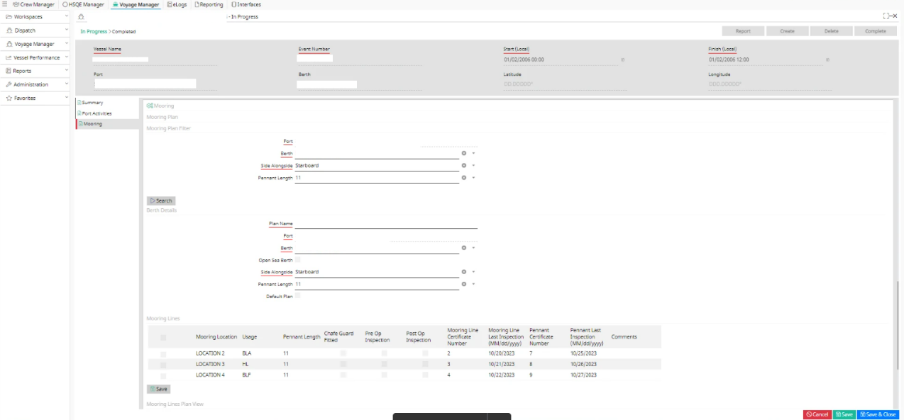
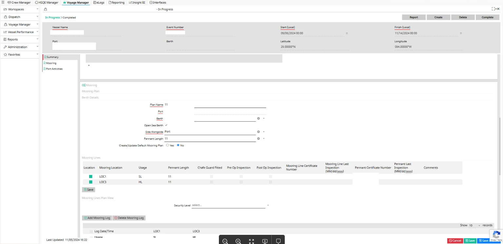

[← Back to Home](index.html)

**Nautical Systems**

**Voyage Manager -- Mooring**

**User Guide**

| Version 6.5.36 | April 2025 |

## Table of Contents
{: .no_toc .text-delta }

1. TOC
{:toc}

# Revision History

Refer to the table below for a detailed record of all modifications made to the document, including key details of each update.

| Date | Version | Who | Description |
|------|---------|-----|-------------|
| 12 March 2025 | V1 | **SM** | Updated to version **6.5.36** |

# Introduction

Refer to this Mooring User Guide for instructions on configuring, managing, and maintaining mooring processes within the *ABS Wavesight Nautical Systems™* application. It covers key functionalities such as Mooring Line and Pennant Configuration, Job Scheduling, Optimoor Plans, and Certificate Management, ensuring efficient tracking and compliance within Nautical Systems.

**Version 6.5.36**.

**Release Date---** April 2025

### Browser Considerations

This application is compatible with the latest versions of both *Google Chrome* and *Microsoft Edge.*

# Overview

Mooring is the process of securing a vessel to a fixed point, such as dock, buoy, or anchor, to prevent unwanted movement caused by wind, waves, and currents. It plays a vital role in maritime safety, ensuring vessels remain stable during loading, unloading or stationary operations. Proper mooring reduces the risk of collisions, protects infrastructure, and enhances overall operational efficiency. By keeping ships securely positioned, mooring supports safe navigation, prevents damage, and ensures the smooth functioning of ports and offshore facilities.

## Key Components of Mooring

Mooring systems rely on several essential components to ensure vessels remain securely positioned in ports, harbors, or offshore environments. These components work together to provide stability, absorb external forces, and facilitate safe docking and anchoring. Understanding these key elements is crucial for efficient and secure maritime operations.

- **Mooring Lines & Ropes**: Strong cables or ropes used to hold the vessel in place.

- **Mooring Pennant**: A short, durable line connecting the vessel to a mooring buoy.

- **Mooring Winch**: A mechanical device that controls and adjusts mooring lines for secure positioning.

# Mooring Workflow

The functionality encompasses comprehensive management of mooring operations and equipment, including documentation, configuration, usage tracking, and maintenance. Key features include:

Comprehensive Mooring Management

- Document and maintain mooring ropes/wires, pennants, and flags.

- Define a master mooring configuration for the vessel and a mooring plan for each port call.

- Record equipment usage, **Line Tension**, and associated maintenance activities such as **Inspections**, **End for end switching of ropes or wires**, and **Equipment disposal** at the end of its lifespan.

Berth-Wise External Plan Linking

Link external mooring plans by vessel type to specific cities and countries.

Configurable Units of Measurement (UOM)

Configure default **UOM** for **Line Tension**, **Line Length**, and **Line Diameter** at both system and ship levels.

Mooring Equipment Designation

- Mark equipment as mooring winches and link mooring locations to them.

- Designate parts as mooring lines or pennants, with options to document mooring specification details.

Serialized Item Management

- Capture mooring line and pennant information for serialized items.

- Record certificate details during purchase order delivery and start-up figures for existing serialized items.

Mooring Configuration and Planning

- Perform overall mooring configuration for the vessel.

- Define mooring plans that specify the ropes/wires, pennants, and flags to be used during each port call.

- Utilize the *Mooring Plan* screen to capture the details of specific mooring equipment, including ropes/wires, pennants, and flags, planned for each port call.

Usage Tracking

Record hourly usage details for each mooring line.

Standard Job Scheduling and Maintenance

- Create and update **Standard Jobs** based on serialized items.

- Schedule serialized Item-based **Standard Jobs**, including **End to End (E2E)**, **End of Life (EOL)**, and **Inspection Jobs**.

- Discard serialized items upon completion of **End-of-Life** work orders.

  - **Notifications**: Notify subscribed users when serialized items are ready for disposal.

The **Mooring Workflow** provides a comprehensive visual representation of the end-to-end process for managing mooring operations, from configuration and planning to execution and maintenance, ensuring streamlined workflows and operational efficiency.

# NS Side Configuration Setup

The **NS Side Configuration Setup** outlines the key configurations required for effective system operation, including system preference, ship settings, general data, city, and country configurations, **UOM** configurations, user notifications, machinery configurations, and *Voyage Manager* settings, ensuring efficient integration and customization.

## System Preference

This section details the configuration options available for mooring operations under **System Preferences**, Users can configure scheduling preferences for **Mooring Ropes Scheduling** and **Other Mooring Lines Scheduling**, with the following options for both:

    - **Counter Based**

    - **Policy Based**

    - **Counter Vs Policy**

These preferences are located under the **Workflow** tab in the *System Preference* screen within the *Maintenance & Purchasing* module.

## Ship Configuration

This section provides the option to manage and document various ship-related details, including technical diagrams and mooring plans, to enhance operational reference and planning.

In the *Ship* screen--- **Technical**--- **Diagrams** section, users can attach a mooring plan diagram for a ship.

**Note:**

There is currently no workflow associated with this feature. However, users can view and refer to the mooring plan as needed.

## General Data Configuration

This section outlines the **General Data Configuration** settings, including **Index Term** options and **Lookup** values used for mooring-related data classification and organization.

Navigation Path: **General Data**--- **Master Data**--- **Index Term**--- **Maintenance Related Terms**--- **SI Reference**.

### Index Term

  - The **Index Term** option includes the **Index Type** (**Part SI Reference**) with the following values:

    - **Mooring Line**

    - **Mooring Pennant**

    - **Mooring Soft Line**

    - **None** (default for all existing Index Terms)

> 

**Note:**

Multiple **Index Terms** can be created for each identity type.

  - The **Mooring Line Type Index Term** is used to identify part types based on the following identities:

    - **Rope - HMPE Jacketed**

    - **Rope - HMPE Non-Jacketed**

    - **Rope - Other**

    - **Wire**

    - **Others** (allows multiple **Index Terms** to be created).

**Note:**

The **Description** field for this term can contain up to **75** characters.

> 

  - The **Item Function Index Term**, is available under **Index Term**--- **Inventory Related**, and includes the following identities:

    - **Mooring Line**

    - **Mooring Pennant**

    - **None (only one Index Term can be created per identity, except for None)**

**Note:**

The **Description** field allows up to **75** characters, and **Import/Export** functionality is available to support **Index Terms**.

> 

  - **Index Term Security** is configured under **General Purposes**.

> 

  - The **Country - New Screen** lookup values can be found in the **Jurisdiction** field in the *Country - New* screen.

  

## UOM Configuration

Uses can configure default **Units of Measurement (UOM)** at either the system level or ship level by navigating to **General Data**--- **Master Data**--- **Voyage Manager**--- **System Configurations**. These configured **UOMs** will be applied by default to **Mooring Lines** or **Mooring Pennant** parts/serialized items in the **Specification** section.

  - **Line Tension**: Only **UOMs** of the **Weight Type** are permitted.

  - **Line Length**: Only **UOMs** of the **Length Type** are permitted.

  - **Line Diameter**: Only **UOMs** of the **Length Type** are permitted.

**Note:**

If the user attempts to select a **UOM** outside the specified types, an error message will be displayed.

## User Notification

An internal notification, **Get Notification on SI Discard**, is available under the **Notifications** tab in the **Maintenance** section of the *User* screen to alert subscribed users when an **SI** is discarded. The notification can be accessed via **System Administration**--- **Users**--- **User Screen**--- **Notifications**--- **Maintenance Notification**.

# Machinery Configuration

To enable the mooring feature in NS, the machinery hierarchy for mooring winches must be configured as **Units** for each ship, with one unit created for each mooring winch. For defining **Mooring Lines** and **Pennants**, it is recommended to create a dedicated **Unit** and assign parts as **Mooring Lines** and **Pennants**. This approach allows for cross-referencing across ships, minimizing the need to create multiple part records.

## Equipment Configuration

This section provides guidance on managing equipment details, including setup through the *Equipment* screen and streamlining data handling with **Equipment Particulars Import/Export** functionalities.

### Equipment Screen

The **Voyage Manager** tab in the **Equipment** record now supports the configuration of **Mooring Winches** and their associated locations, equivalent to the drum positions on a winch (each winch may have multiple drums/locations).

Mooring Winch Identification

  - Equipment must be marked as **Mooring Winch** to use this feature.

  - Users can select the **Mooring Winch** option from the **Identify Equipment** as field in the **Maintenance & Purchasing**--- **Equipment**--- **Voyage Manager** tab.

  

Location Details

For **Mooring Winches**, location details must be added via a grid, ensuring the **Location Name** is unique to the specific winch. **Grid Columns** include:

  - **Location Name (varchar, 100)**

  - **Position (Lookup)**

  - **Usage (Lookup)**

  - **Lead (Lookup)**

Under the **Mooring Winch Unit**, users can create one or more **Mooring Locations** as **Maintained Parts**. To configure the mooring locations and lines:

  - **Mooring Lines** will be created as **Serialized Items**. Once the **Serialized Items** checkbox is selected, an additional tab will be enabled to save **Mooring Line**-related information.

  

  

  

> **Note:**
>
> If a duplicate **Location Name** is entered, an error message will display: *\[Location name\] already exists in Mooring Location table*.

Validation Rules

  - Locations in use within any record cannot be deleted.

  - The **Location Name** is mandatory when creating a new entry. If left blank and the user clicks save, without giving the location name, an error message will display: *Location Name is mandatory in Mooring Winch!*

  - Validation for **ETE (End-to-End)** and **EOL (End-of Life)** values:

    - **ETE Ropes** must be less than **EOL Ropes**; otherwise, a validation error will occur.

    - **EOL Ropes** must be greater than **ETE Ropes**; otherwise, a validation error will occur.

    - **ETE Others** must be less than **EOL Others**; otherwise, a validation error will occur.

    - **EOL Others** must be greater than **ETE Others**; otherwise, a validation error will occur.

- **Lookup Types**:

  - **Mooring Position**: Values include **Forward**, **Mid**, and **Aft**.

  - **Mooring Usage**: Values include **SL**, **BLA**, **SLA**, **HL**, **BLF**, and **SLF**.

  - **Mooring Lead**: Values include **Port**, **Starboard**, and **Either**.

> 

# Equipment Export

This section outlines the export functionality, focusing on **Part Configuration**, **Serialized Item Configuration**, and **Standard Job Configuration**, to ensure effective policy-level management and data consistency.

## Part Configuration

This section provides details on managing part-related data through the **Part Screen**, **Part Import/Export (XLSX)**, and **Part Import (XML)** functionalities, enabling efficient handling of part configurations.

### Part Screen

The *Part* screen enhances the configuration and management of mooring lines and related validations. The **Mooring Lines** tab includes the following fields.

Specifications

- **Material/Construction**: UI - 100 characters, DB limit - 150 characters

- **D/d Ratio at Pedestal**: UI/DB limit - 4,2

- **D/d Ratio at Fair Lead**: UI/DB limit - 4,2

- **LDBF**: UI/DB limit - 8,2 + UOM (Type: Weight)

- **WL**: UI/DB limit - 8,2 + UOM (Type: Weight)

- **Shock Load**: UI/DB limit - 8,2 + UOM (Type: Weight)

- **Overload**: UI/DB limit - 8,2 + UOM (Type: Weight)

- **Original Length**: UI/DB limit - 5,2 + UOM (Type: Length)

- **Original Diameter**: UI/DB limit - 4,2 + UOM (Type: Length)

Limitations

- **MAX_HOURS_OF_USE**: Old Field Length (6,2) \--\> New Field Length (8,2)

- **MAX_NUMBER_OF_USES**: Old Field Length (4,0) \--\> New Field Length (6,0)

- **ETE_REMAINING_HRS_OF_USE**: Old Field Length (6,2) \--\> New Field Length (8,2)

- **ETE_REMAINING_NO_OF_USE**: Old Field Length (4,0) \--\> New Field Length (6,0)

- **EOL_REMAINING_HRS_OF_USE**: Old Field Length (6,2) \--\> New Field Length (8,2)

- **EOL_REMAINING_NO_OF_USE**: Old Field Length (4,0) \--\> New Field Length (6,0)

- **STARTUP_NO_OF_USES**: Old Field Length (4,0) \--\> New Field Length (6,0)

- **STARTUP_HOURS_OF_USE**: Old Field Length (6,2) \--\> New Field Length (8,2)

- **TOTAL_NUMBER_OF_USES**: Old Field Length (4,0) \--\> New Field Length (6,0)

**\**

Startup Figures

- **Startup Hours of Use** : UI - 8,2 (DB - 10,2) - Carryover Hours of use

- **Startup Number of Uses**: UI - 6,0 (DB - 10,2) - Carryover Number of use

- **Total Time in Use**: UI - 8,2 (DB - 10,2)

- **Total Number of Uses**: UI - 6,0 (DB - 10,0)

- The validations for **Specification** and **Limitation** in **SI Mooring Line** tab must be the same as the **Part Mooring Line** tab.

- Once the SI is installed for the first time, the **Start-up Hours of Use** and **Start-up Number of Use** fields will be disabled.

- The **Total Time in Use** and **Total Number of Uses** fields will also be disabled and will instead be updated automatically based on hours recorded during a Port Stay.

- The **Edit Startup Figures** authorization option under **Serialized Item** is unchecked by default.

- If authorization is not granted, this section will remain disabled.

  

Serialized Items Tab

- The **Certificate column** will display allowing users to select/deselect linked certificates.

- This column will display the certificate name along with its number.

Field Access and Authorization

Fields will be enabled or disabled based on the following authorizations:

- **Edit Machinery Part**

- **Edit Consumable item**

- **Edit Machinery Parts for Restricted Equipment**

- **Edit Consumable Items for Restricted Consumable Types**

Validations

- **Material/Construction**: Maximum length is **100** characters.

- **UOM Requirements**: Every specification value with a **UOM** must have a valid **UOM**, and vice versa, or an error message will be displayed.

- **ETE/EOL Rules**:

  - **ETE Ropes** must be less than **EOL Ropes**.

  - **EOL Ropes** must be greater than **ETE Ropes**.

  - Similar rules apply for **ETE Others** and **EOL Others**.

  - **Max Hours/Number of Uses**: If **Max Hours of Use** or **Max Number of Uses** is provided, then **Half Life Hours** or **Half Life Number of Uses** can be set to **0** without restriction.

> **Note:**

The user is allowed to reset Half-Life values to **0**. However, If this done, E2E jobs will not be scheduled.

  - **Half Life Hours/Number of Uses Validation**:

    - If these values are **0** and **E2E Remaining Hours of Use**/**Remaining Number of Uses** values are provided, a warning message will be displayed.

    - If the user selects **No**, the part will not be saved, and the screen will remain open for editing. If **Yes**, the part will be saved, but **E2E** jobs will not be scheduled.

- **Remaining Hours of Use/Remaining Number of Uses Validation**:

  - **Remaining Hours of Use/Remaining Number of Uses** must be less than **Max Hours of Use** and **Max Number of Uses**, respectively, if **Half Life Hours** or **Half Life Number of Uses** values are provided.

  - If these remaining values exceed max values when **Half Life Hours/Number of Uses** is set to **0**, a warning will notify the user: *Remaining Hours of Use/Remaining Number of Uses must be less than Max Hours of Use/ Max Number of Uses E2E jobs will not be scheduled. Continue?*

  - If the user selects **Yes**, the system will not validate other validations and will allow saving the part with those values, but E2E jobs will not be scheduled.

- **E2E Scheduling Validations**:

  - **For E2E Remaining Hours of Use**: Validation will only occur if a Half Life Hours value is provided.

  - **For E2E Remaining Number of Uses**: Validation will only occur if a Half Life Number of Uses value is provided.

  - Remaining Hours/Number of Uses should not exceed:

    - **(Max Hours of Use \* Half Life Hours of Use) / 100.**

    - **(Max Number of Uses \* Half Life Number of Uses) / 100.**
- **Mandatory Fields**: Original length is required for parts with **SI** references of type **Mooring Line/Pennant/Soft Line**.

- **Applicability**: All the above validations also apply to the **Mooring Line** tab of the *Serialized Item* screen.

  - Default UOM Configuration:

  - UOMs will default from **Ship Configuration** settings, with fallback to **System Configuration** settings.

  - **Line Tension UOM**: Default for **LDBF**, **Shock Load**, **WL**, and **Overload**.

  - **Line Length UOM**: Default for **Original Length**.

  - **Line Diameter UOM**: Default for **Original Diameter**.

> **Note:**
>
> Preference will always be given to **Ship Configuration** settings before applying **System Configuration** settings.
>
> 

### Part Import/Export (XLSX)

The **Part Import/Export (XLSX)** supports fields and validations, enabling more comprehensive data handling for mooring specifications and related configurations. In the **Part_Header_Detail** sheet:

 - The **MOORING_LINE_TYPE** column's value contains the description. During import:

    - If the system finds a matching index term with the same name, it will link it.

    - If no match is found, the system will display a warning and skip the update.

- The fields in the **Mooring Line** sheet capture mooring specification details:

  - **REFID**

  - **MATERIAL_CONSTRUCTION**

  - **D/D_RATIO_AT_PEDESTAL**

  - **D/D_RATIO_AT_FAIR_LEAD**

  - **LDBF**

  - **LDBF_UOM (Validation: Must be of type Weight)**

  - **WL**

  - **WL_UOM (Validation: Must be of type Weight)**

  - **SHOCK_LOAD**

  - **SHOCK_LOAD_UOM (Validation: Must be of type Weight)**

  - **OVERLOAD**

  - **OVERLOAD_UOM (Validation: Must be of type Weight)**

  - **ORIGINAL_LENGTH**

  - **ORIGINAL_LENGTH_UOM (Validation: Must be of type Length)**

  - **ORIGINAL_DIAMETER**

  - **ORIGINAL_DIAMETER_UOM (Validation: Must be of type Length)**

  - **MAX_HOURS_OF_USE (UI/DB format: 6,2)**

  - **MAX_NUMBER_OF_USES (UI/DB format: 3,0)**

  - **HALF_LIFE_HRS_OF_USE (UI/DB format: 3,0)**

  - **HALF_LIFE_NO_OF_USES (UI/DB format: 3,0)**

  - **END_TO_END_REAMAINING_HOURS_OF_USE (UI/DB format: 6,2)**

  - **END_TO_END_REAMAINING_NO_OF_USES (UI/DB format: 3,0)**

  - **END_OF_LIFE_REAMAINING_HOURS_OF_USE (UI/DB format: 6,2)**

  - **END_OF_LIFE_REAMAINING_NO_OF_USES (UI/DB format: 3,0)**
- Validations in **Part Excel Import**:

  - If **Half Life Hours** or **Half Life Number of Uses** values are **0**, and **E2E Remaining Hours of Use** or **E2E Remaining Number of Uses** values are provided:

    - The system will log a warning message, such as:

      - *#Warning : ETE job will not be scheduled since \"Half Life Hours of Use %\" is not specified at line # 1.*

      - *#Warning : ETE job will not be scheduled since \"Half Life Number of Uses %\" is not specified at line # 1.*

    - The imports will proceed, and all valid data, including **E2E values**, will be imported.

  - If **Half Life** values are left blank or set to **0**, and no **E2E values** are provided:

    - The system will import the data successfully without restricting the user, even if the **Half Life** fields have a **0** value.

### Part Import (XML)

Validation for **Part XML Import**:

  - If **Half Life Hours or Half Life Number of Uses** value is set to **0**, and **E2E Remaining Hours of Use** or **E2E Remaining Number of Uses** values are provided:

    - A warning message will be logged:

      - *#Warning : ETE job will not be scheduled since Half Life Hours of Use % is not specified.*

      - *#Warning : ETE job will not be scheduled since Half Life Number of Uses % is not specified.*

- The system will import all valid data successfully, including the **E2E** values, without restricting the user for **Half Life** fields set to **0**.

## Serialized Item Configuration

This section provides information related to the *Serialized Item (SI)* screen, including the addition of the **Mooring Line** tab, improved **Import/Export** functionality, and updated validation rules for accurate data handling and streamlined management of serialized items related to mooring lines, pennants, and soft lines.

### Serialized Item Screen

The *Serialized Item* screen enhances **Mooring Line** tab, providing users with detailed fields for tracking and managing specifications, limitations, key dates, and operational data for serialized items.

**Notes:**

- This tab will be hidden if the parts are not of type **Mooring Line**, **Pennant**, or **Soft Lines**.

- It will appear as the first tab if the **SI** type is mooring-related.

Fields in the Mooring Line Tab - Boxed Section

- **Certificate No**: (UI: 100 chars, DB: 150 chars) -- The certificate number linked to **PO** delivery or added later. One certificate can be associated with multiple **SIs**.

- **Position**: Lookup value selected when the SI is in an Equipment location

- **Lead**: Lookup value selected when the SI is installed in an Equipment location

- **Mooring Line Type**: Copied from the associated part record to the SI

Specifications

- **MAX_HOURS_OF_USE**: Old Field Length (6,2) \--\> New Field Length (8,2)

- **MAX_NUMBER_OF_USES**: Old Field Length (4,0) \--\> New Field Length (6,0)

- **ETE_REMAINING_HRS_OF_USE**: Old Field Length (6,2) \--\> New Field Length (8,2)

- **ETE_REMAINING_NO_OF_USE**: Old Field Length (4,0) \--\> New Field Length (6,0)

- **EOL_REMAINING_HRS_OF_USE**: Old Field Length (6,2) \--\> New Field Length (8,2)

- **EOL_REMAINING_NO_OF_USE**: Old Field Length (4,0) \--\> New Field Length (6,0)

- **STARTUP_NO_OF_USES**: Old Field Length (4,0) \--\> New Field Length (6,0)

- **STARTUP_HOURS_OF_USE**: Old Field Length (6,2) \--\> New Field Length (8,2)

- **TOTAL_NUMBER_OF_USES**: Old Field Length (4,0) \--\> New Field Length (6,0)

Key Dates

- **Received on Board Date**: The delivery date of the SI.

- **Last Inspected Date**: Date of the completed WO related to the inspection SJ.

- **Entered Service Date**: First installation date of the SI.

- **Projected Section**:

    - **End-to-End Date**: Scheduled date for an end-to-end switch of the SI.

    - **Replacement Date**: Scheduled EOL switch date for the SI.

- **Actual Section**:

    - **End-to-End Date**: Completion date of the end-to-end switch of the SI.

    - **Replacement Date**: Date when the SI was discarded after usage.

Field Definitions

  - **MAX_HOURS_OF_USE**: Old Field Length (6,2) \--\> New Field Length (8,2)

  - **MAX_NUMBER_OF_USES**: Old Field Length (4,0) \--\> New Field Length (6,0)

  - **ETE_REMAINING_HRS_OF_USE**: Old Field Length (6,2) \--\> New Field Length (8,2)

  - **ETE_REMAINING_NO_OF_USE**: Old Field Length (4,0) \--\> New Field Length (6,0)

  - **EOL_REMAINING_HRS_OF_USE**: Old Field Length (6,2) \--\> New Field Length (8,2)

  - **EOL_REMAINING_NO_OF_USE**: Old Field Length (4,0) \--\> New Field Length (6,0)

  - **STARTUP_NO_OF_USES**: Old Field Length (4,0) \--\> New Field Length (6,0)

  - **STARTUP_HOURS_OF_USE**: Old Field Length (6,2) \--\> New Field Length (8,2)

  - **TOTAL_NUMBER_OF_USES**: Old Field Length (4,0) \--\> New Field Length (6,0)

Startup Figures

  - **Startup Hours of Use**: (UI/DB: 6,2) - Carryover hours of use.

  - **Startup Number of Uses**: (UI/DB: 4,0) - Carryover number of uses.

  - **Total Time in Use**: (UI/DB: 6,2)

  - **Total Number of Uses**: (UI/DB: 4,0)

Validation Rules

  - All **Specifications** and **Limitations** validations in the **SI Mooring Line** tab must match the rules in the **Part Mooring Line** tab.

  - Once the SI is installed for the first time, **Startup Hours of Use** and **Startup Number of Uses** will be disabled.

  - **Total Time in Use** and **Total Number of Uses** will be display-only and updated automatically from port stay entries.

> 

Authorization

  - The **Edit Startup Figures** authorization option under **Serialized Item** is unchecked by default

  - If enabled, the **Startup Figures** section in the **Mooring Line** tab will be editable; otherwise, it will remain disabled.

> 

### Serialized Item Import/Export

The **Serialized Item Import/Export** functionality supports mooring-specific data, including a new **Mooring Line** sheet for streamlined data handling.

  - **Mooring Line** data details will be included during export and can be successfully imported if the sheet contains valid data.

  - If the columns in the **Mooring Line** sheet are empty, the system will automatically pull data from the associated **Part's Mooring Line** tab.

Validation in SI Excel Import

  - If **Half Life Hours** or **Half Life Number of Uses** is set to **0**, and **E2E Remaining Hours of Use** or **Remaining Number of Uses** values are provided:

    - A warning message will be logged:

      - *#Warning : ETE job will not be scheduled since \"Half Life Hours of Use %\" is not specified at line # 1.*

      - *#Warning : ETE job will not be scheduled since \"Half Life Number of Uses %\" is not specified at line # 1.*

    - The system will import all valid data, including the **E2E** values, without restrictions.

- If **Half Life** values are blank or set to 0, and no **E2E** values are provided:

  - The system will successfully import the data without restrictions.

The *Serialized Item Certificate Search* screen includes a **Certificate Creation** option in the **Process** menu for easier certificate management. The **Serialized Item Import/Export** functionality supports **SI Certificate Import/Export** including attachments.

**Serialized Item Import/Export Excel Template** (**MOORING_LINE** tab): The following columns include:

- **CERTIFICATE_NAME**

- **CERTIFICATE_NO**

- **ISSUE_DATE** (Date format: mm/dd/yyyy)

- **EXPIRY_DATE** (Date format: mm/dd/yyyy)

- **ATTACHMENT_NAME**

- **ATTACHMENT_FILE_REFERENCE** (Place **SI Certificate** attachments in the **Attachments** folder, located in the same directory as the **Excel** file)

**Notes:**

- A single certificate can be linked to multiple **SIs**.

- Only one copy of the certificate attachment needs to be placed in the folder, even if linked to multiple items.

- The issue where only the first certificate was being linked to multiple SIs during PO delivery has been resolved.

  

## City/Country Configuration

This section outlines the *City* and *Country* Configuration settings, including indexing, Jurisdiction, and validation rules for managing geographic data related to mooring operations. *City Country Search* screen can be accessed under **General Data**--- **Master Data**--- **General**--- **Cities & Countries**.

Country Screen

The *Country* screen includes fields for Index Term and Jurisdiction to categorize and manage country-specific information. Duplicate country names (e.g., one in lowercase and another in uppercase) and duplicate country abbreviations are not permitted to ensure data consistency.

City Screen

The *City* screen features a read-only **Region** field that displays the region of the associated country. The **Jurisdiction** field is single-select, allowing users to assign a jurisdiction at the **City** level. **Index Term Security Level** is managed under **General Purpose**.

To prevent duplication, new city records are validated against the **State/Province** field in addition to the existing **Country** and **City Name** validations. This ensures that multiple cities with the same name can exist in different states or provinces, commonly seen in the U.S. and other countries.

### City/Country Import/Export

This section outlines the **City/Country/Import/Export** process and includes the following sheets:

- The **City-Country** first sheet includes the following columns:

  - **COUNTRY_ABBR,**

  - **COUNTRY_CURR_ABBR**

  - **COUNTRY_REGION**

  - **COUNTRY_JURISDICTION**

  - **CITY_JURISDICTION (added after City ABBREVIATION**).

- The ***COUNTRY_REGION*** column will display the name of the region from the **Region Index Term**.

- The ***COUNTRY_JURISDICTION*** and ***CITY_JURISDICTION*** columns will display the **Jurisdiction Lookup** descriptions.

  

- The **Berth** second sheet includes the following columns:

  - **BERTH**

  - **BERTH_LATITUDE**

  - **BERTH_LONGITUDE**

  - **REF_ID**

  - **BERTH_REF_ID**

  - **IDCODE**

  

- The **Mooring** third sheet includes the following columns:

  - **ALONGSIDE**

  - **VESSEL_TYPE**

  - **OPTIMOOR_VERSION**

  - **VERSION**

  - **DATE**

  - **MONSOON**

  - **COMPATIBILITY**

  - **EXT_PLAN_ATTACHMENT_NAME**

  - **EXT_PLAN_FILEREFERENCE**

  - **REPLICATE\",\"REMARKS**

  - **REF_ID**

  - **BERTH_REF_ID**

  - **IDCODE**

  

## Berth Configuration

The *New/Edit Berth* screen includes a grid with the following columns:

- **AlongSide**: Lookup value from the **Draft List** type.

- **Vessel Type**: Index Term for **Vessel Type**.

- **Optimoor Version**: Alphanumeric field for entering the **Optimoor** version.

- **Version**: Numeric field for the berth plan version.

- **Date**: Date selection field for berth plans.

- **Monsoon**: Lookup values from the **Monsoon** type

- **Compatibility**: Alphanumeric field for compatibility details.

- **Ext. Mooring Plan**: Option to link an attachment to the row.

- **Replicate**: Checkbox for enabling replication.

- **Remarks**: Free-text field for adding remarks.

Optimoor Plan Management

**Optimoor Plans** are controlled documents, with the actual files managed in the **Document Management System (DMS)** and linked to the appropriate **Berth**.

The **Optimoor Plan** **Index** serves as a master list of all **Optimoor** plans, each containing a set of attributes displayed in the **Proposed UI**. Additionally, an **Optimoor Plan** record is created, mirroring the data elements displayed in the grid, to store master data for each plan.

This structure allows **Optimoor** documents to be filtered by **Vessel Type**, **Berth**, and **Side Alongside**, ensuring that onboard users can only access relevant **Optimoor** plans when viewing or planning a **Port Call**.

The grid also features **Add** and **Remove** buttons, allowing users to manage berth entries by adding or deleting rows. Multiple **Ext. Mooring Plans** can be linked to **City**, **Berth**, **AlongSide**, **Vessel Type**, and other related fields. Each port city can have multiple berths, with some cities supporting **100-350** berths. Replication is managed based on **Vessel Type**. The **Berth List** grid has two new columns:

- **Ext. Mooring Plan**: Displays the name of the attached external mooring plan.

- **Ext. Mooring Plan Status**: Displays Yes in the **City**--- **Berth**--- **Ext. Mooring Plan** column if the berth has at least one external plan attached.

## Standard Job Configuration

The **Standard Job Configuration** supports maintenance and inspection workflows for **SIs**, providing greater flexibility in scheduling, linking references, and managing serialized jobs efficiently.

### Create Screen

In **Standard Job Configuration**, a standard job is created by defining the job type details, associating it with the relevant equipment or component, and specifying the required parameters and scheduling criteria.

### Edit Screen

The *Edit* screen will display detailed serialized item information for both calendar-based and counter-based jobs, ensuring streamlined management of linked serialized items.

Calendar-Based Jobs

- The **Serialized Items** tab will display all linked serialized items based on the SI reference.

- These jobs will display the **Last Done Date** for all linked serialized items.

  

  - These jobs are mostly inspection-related, and the **Inspection** checkbox in the **Admin Info** tab must be checked.

  

Counter-Based Jobs

  - The **Serialized Items** tab will display all linked serialized items based on SI Reference.

    

- These jobs will display the **ETE Date** and **EOL Date** for all linked serialized items.

  

### Standard Job Excel Import/Export

The **Standard Job Excel Import/Export** supports the creation and updating of **Serialized Job Types (SER)** and to handle linked serialized item references efficiently.

- **Calendar-Based Jobs**: Multiple calendar-based jobs can be created for the same SI Reference with different job size indexes

- **Counter-Based Jobs**:

  - Only one counter-based job is allowed for each **SI_REFERENCE**.

  - During Import:

    - If a counter-based SJ with same **SI_Reference** already exists, an appropriate message will be displayed for that row.

    - If multiple rows in the Excel file have the same **SI_Reference** for the counter-based jobs, only one SJ will be created if none exists.

    - **Inspection Jobs**: The **Inspection_Job** column enables importing inspection-specific jobs for serialized items.

# Purchasing Workflow

This section outlines the **Purchasing Workflow** for mooring-related items, including the PO delivery process and certificate management for serialized items.

## PO Delivery Process

This section details the **PO Delivery Process**, which supports the tracking and management of serialized items in mooring operations. The *SI PO Delivery* screen includes essential information, ensuring proper documentation and compliance, Additionally, selected attachments are linked to the corresponding tagged serialized items for record-keeping.

- Name

- SI Reference

- Certificate Name: A text field to specify the certificate name.

- Certificate Type: A dropdown selection field for specifying the certificate type.

- Certificate No

- Issue Date

- Expiry Date

- Certificate: A hyperlink to the actual SI Certificate.

- Attach Column: Allows row-level attachments.

Certificate Management

Users can manage certificates by either creating a new certificate and linking it to multiple serialized items or associating an existing certificate with a serialized item by selecting from a list of available certificates. The same functionality extends to the Part Level, where the *Part* screen includes serialized references for better traceability.

Shipping Manifest

During the **Shipping Manifest** process, the same columns and certificate management options are available when taking delivery, ensuring consistency in handling mooring-related purchases.

Data Handling in Serialized Items

- The **Received On Board Date** in the **Mooring Line** tab of the serialized item will match the **PO Delivery Date**.

- During PO delivery, the **Last Done Date (LDD**) of the serialized item will remain blank.

- During rope installation from the *Voyage Manager (VM)*, the LDD will be updated for the first time if no completed WO exists for it in NS.

# Mooring Ropes/Other Mooring Line Job Scheduling

This section outlines the job scheduling process for **Mooring Ropes** and **Other Mooring Lines**, including configuration options that determine how maintenance and inspections are scheduled. These scheduling preferences help ensure proper tracking, upkeep, and compliance with operational requirements.

## SI-Based Standard Job

- **ETE and EOL Jobs**: For **SIs** that are not discarded, linked to the **SI Reference** of the SJ, and marked as **Mooring Line** or **Mooring Pennant**:

  - One job will be scheduled for ETE.

  - One job will be scheduled for EOL

  - The **Based On** field must be checked for these jobs to be scheduled.

- **Regular Calendar/Counter Jobs**: If the above conditions are not met, jobs will be scheduled as regular calendar or counter-based jobs, supporting inspection-type jobs.

## Calendar Based Job Scheduling

- Jobs are scheduled based on the calendar interval specified at the Job level.

- The **Last Done Date (LDD)** for serialized items is considered for scheduling.

**Last Done Date Management**

- The system uses the last done date for all serialized items linked to the **SI Reference** while creating a calendar-based SJ.

- The last done date of serialized items can be modified until the job is scheduled.

- For serialized items marked as **Mooring Line** or **Mooring Pennant** and created via **PO Delivery**, **Shipping Manifest** **Delivery**, and *Part* screen, the system sets the last done date as the SI creation date.

  

## **Counter Based Job Scheduling**

- Counter-based SJ creation for serialized items includes the following workflow:

  - Scheduling is based on **Mooring SI Running Hours** or **Number of Uses** (**Total Time in Use**/**Total Number of Uses**).

  - Job titles are combination of the **Serial number** and **SJ Job Title**.

  - Overdue jobs are marked red.

- **Unique Scheduling Logic**: Unlike standard counter-based jobs, these jobs are scheduled specifically based on **SI Running hours**/ **Number of Uses**.

**Note:**

Once a job is completed, it will be rescheduled.

### Scheduling Based On Counter

This section details the scheduling calculations and workflow for ETE and EOL jobs based on serialized item (SI) running hours, number of uses, and policy settings.

- **Example 1**: **Scheduling based on Running hours**

  - SI values from **Port Stay** event:

    - Max Hours of Use: 1000

    - Half Life Hours of Use (%): 50%

    - Schedule End To End - Remaining Hours of Use: 40

    - Schedule End Of Life - Remaining Hours of Use: 100

### Scheduling End To End Job

- **Calculation**:

  - End-To-End Job = (50 % of Max Hours of Use) - Remaining Hours Of Use

  - End-to-End Job = (50% of 1000)-40 = 500 - 40 = 460

- The system will schedule the **End to End Job** once the **SI** running hours reach **460** hours.

- If the **Half-life Hours of Use** is set to **0**, the **ETE** job will not be scheduled.

### Scheduling End Of Life Job

- **Calculation**:

  - End-Of-Life Job = Max Hours of Use - Remaining Hours Of Use

  - End-to-End Job = 1000 -- 100 = 900

- The system will schedule the **End Of Life** job once the SI running hours reach **900** hours.

- If the **Remaining Hours Of Use** is set to **0**, the **EOL** job will be scheduled when the total running hours reach **1000**.

  

  

- **Example 2: Scheduling based on Number of Uses**

  - SI values from **Port Stay** event:

    - Max Number of Uses: 10

    - Half Life Number of Uses (%): 50

    - Schedule End To End - Remaining Number of Uses: 1

    - Schedule End Of Life - Remaining Number of Uses: 2

### Scheduling End To End Job

- **Calculation**:

  - End-To-End Job = 50% of Max Number of Uses - Remaining number Of Uses

  - End-to-End Job = (50% \* 10) -- 1 = 5 -- 1 = 4

- The system will schedule the ETE Job once the SI count reaches 4 uses.

- If the Half-Life Number of Uses is set to 0, the ETE job will not be scheduled.

### Scheduling End Of Life Job

- **Calculation**:

  - End-To-Life Job = Max Number of Uses - Remaining number Of Uses

  - End-to-Life Job = 10 -- 2 = 8

- The system will schedule the EOL Job once the SI count reaches 8 uses.

- If the **Max Number of Uses** is provided but other values are missing, the job will be scheduled once the counter reading reaches the boundary value.

## Policy Based Scheduling

Policy-based scheduling is governed by system preferences and requires specific configurations for serialized items

### **System Preference**

- **Mooring Line Scheduling Preference**: Defines the policy period for **ETE** and **EOL** jobs for **Mooring Lines**.

- **Pennant Scheduling Preference**: Sets the policy-based scheduling rules for **Mooring Pennants**.

  

### Requirements:

- **Serialized Item Reference**: The **Part** must have **Mooring Line** or **Pennant SI Reference**.

  

- **Serialized Items**: Must exist in the system for the **Part** to allow scheduling.

- **Policy Periods**: **ETE** and **EOL** policy periods must be defined in the preferences or overridden at the item level.

- **Example**:

  - **Configuration**:

    - Configure the SI in VM, override the policy level as needed, and add the installation date.

      

      

  - **Example SI**:

    - SI Number: 5

    - ETE Policy Month: 6

    - EOL Policy Month: 12

    - Install Date: 01/06/2024.

- **Scheduling Calculations**:

  - ETE Job: Scheduled as Install Date + 6 months = 07/06/2024.

  - EOL Job: Scheduled as Install Date + 12 months = 01/06/2025.

  

  

**\**

  - **Recalculation**:

    - Once completed, navigate to the Ship Level in NS, and use the **Tool** tab to recalculate.

    - The system will calculate, and update schedules based on changes, ensuring accurate alignment with the policy.

      

  - **Schedule Nodes**:

    - Nodes are added based on the install date and policy periods.

    - **Example**:

      - If Policy Months = 0, the job will not be scheduled.

      - For SI 8, where ETE Policy Month = 0, only the EOL job will be scheduled.

- **Delta Changes**:

  - After completing an ETE job, recalculations adjust the schedule for EOL jobs.

  - Example: SI 5's EOL job rescheduled to 09/07/2025 based on recalculated ETE delta changes.

## Counter vs Policy Job Scheduling

The System Preference for Counter vs Policy Job scheduling determines how ETE and EOL dates are calculated, as follows:

  - **ETE Date Calculation**:

- The **ETE** date is based on the **counter reading** if it occurs earlier than the policy-based **ETE** date.

- The **ETE** date is based on the **policy period** if the policy-based **ETE** date occurs earlier than the counter reading.

  - **EOL Date Calculation**:

- The EOL date is based on the counter if it occurs earlier than the policy-based EOL date.

- The EOL date is based on the policy period if the policy-based EOL date occurs earlier than the counter reading.

  

#### Maintenance Plan

- The **Maintenance Plan** will display **ETE** and **EOL** SI-based **Standard Jobs**.

- **SI Reference Search**: Users can search by **SI Reference** in the **Maintenance Plan**.

- **Counter-Based Job Titles**:

  - **ETE Jobs**: The title is generated as ETE Serial Number+ SJ Job Title

  - **EOL Jobs**: The title is generated as EOL Serial Number + SJ Job Title

  

The **Maintenance Plan** will also display **WOs** for **Counter-based SI Standard Jobs** with the same title format:

  - **ETE WOs**: ETE Serial Number+ SJ Job Title

  - **EOL WOs**: EOL Serial Number + SJ Job Title

  

  - These jobs are mostly inspection-related, and the **Inspection** checkbox in the **Admin Info** tab must be checked.

### SI Discard on Work Order

When the **EOL Work Order** is completed, the system will automatically mark the associated serialized item as **Discarded**, and an internal notification will be sent to all subscribed users.

To subscribe for discarded notifications, refer to the **User Notification** section.

## Search

The **Search** feature provides users with improved filtering and search capabilities, allowing for more efficient management and retrieval of data.

### Equipment Search

In the **Equipment** search, enables users to identify equipment more precisely using the **Identify Equipment** **As** filter under the **General** section.

### Part Search

The **Part Search** enhances usability by allowing users to find parts in the **Mooring** section using the following filters:

  - **WLL**

  - **Original Length**

  - **Original Diameter**

  

### Standard Job Search

The **Standard Job Search** enhances search functionality. Based on the **Show Linked SI** filter, a child grid for **Serialized Items** will display the serialized items linked to the highlighted SJ.

The **Serialized Items** grid includes the following columns:

  - **Name**

  - **Serial No**

  - **Last Done**

  - **Scheduled**

  - **Status (displays the overdue status of each serialized item).**

**Note:**

The **Last Done**, **Scheduled**, and **Status** columns will remain empty in the main grid for serialized SJs.

### Serialized Item Search

The **Serialized Item Search** enhances search and filtering capabilities for **Mooring Lines** and **Pennants.**

### City Country Search

The **City and Country Search** enhances jurisdiction-based searches with multi-select functionality, allowing users to select multiple jurisdictions. Navigation path: **General Data**--- **Master Data**--- **General**--- **Cities and Countries.**

### **SI Certificate Search**

The **SI Certificate Search** enhances certificate management and tracking by providing search and filtering capabilities.

Menu availability at **Fleet** level:

  - **Maintenance**--- **Documents**--- **Search**--- **SI Certificate**

  - **Purchasing**--- **Documents**--- **Search**--- **SI Certificate**

  - **Inventory**--- **Documents**--- **Search**--- **SI Certificate**

Search filters:

  - **Certificate Name**

  - **Certificate No**

  - **Issue Date**

  - **Expiry Date**

  

**Expiry Status** column with color-related indicators based on the expiry date:

  - **Green**: Expiry Date is more than **60** days away.

  - **Yellow**: Expiry Date is between **30** and **60** days away.

  - **Amber**: Expiry Date is within the next **30** days.

  - **Red**: Expiry Date has passed.

Listed filters:

  - Valid for more than **60** days

  - Expiry in the next **30-60** days

  - Expiry in the next **0-30** days

  - Expired

**Note:**

The results will display all available fields of the **SI Certificate**, except the attachment.

The *Serialized Item Certificate Search* screen includes a **Certificate Creation** option in the **Process** menu for easier certificate management. The **Serialized Item Import/Export** functionality supports **SI Certificate Import/Export** including attachments.

**Serialized Item Import/Export Excel Template** (**MOORING_LINE** tab): The following columns include:

  - **CERTIFICATE_NAME**

  - **CERTIFICATE_NO**

  - **ISSUE_DATE** (Date format: mm/dd/yyyy)

  - **EXPIRY_DATE** (Date format: mm/dd/yyyy)

  - **ATTACHMENT_NAME**

  - **ATTACHMENT_FILE_REFERENCE** (Place **SI Certificate** attachments in the **Attachments** folder, located in the same directory as the **Excel** file)

**Notes:**

  - A single certificate can be linked to multiple **SIs**.

  - Only one copy of the certificate attachment needs to be placed in the folder, even if linked to multiple items.

  - The issue where only the first certificate was being linked to multiple SIs during PO delivery has been resolved.

  

## Gadgets

The **Gadgets** feature supports serialized jobs, enhancing visibility and tracking of overdue jobs.

### Overdue Job Gadgets

  - Supports the **Serialized Type SJs**.

  - For **Serialized Type SJs**, the title will display as:

    - **Serial No + Sj Name** for calendar-based jobs.

    - **EOL/ETE + Serial No. + SJ Name** for Mooring Jobs.

  

## Reports

The **Reports** feature supports and provides comprehensive information on **Mooring Lines**, **Serialized Items(SIs)**, and **Standard Jobs** across various reports.

### Part Detail Report

- Displays **Mooring Line Information** along with other part details.

- Navigation Path: **Part Screen**--- **Reports**--- **Part Detail**

  

### Serialized Item (SI) Form

- Displays **Mooring Line Information** along with other serialized item details.

- Navigation Path: **SI Screen**--- **Reports**--- **Serialized Item Form**

  

  

### Standard Job Reports

The **Standard Job** **Reports** feature provides comprehensive information on **Serialized Items(SIs)** and their associated jobs, enhancing tracking and reporting for **SI-based Standard Jobs**.

### Standard Job Description

- Lists linked serialized items for **SI-based Standard Jobs**.

- Navigation Path: **Module level**--- **Reports**--- **Standard Job Description**

  

  

### Standard Job Query Listing

- Displays linked serialized items for **SI-based Standard Jobs**.

- Navigation Path: **Standard Job Search Screen**--- **Reports**--- **Standard Job Query Listing.**

  

### Counter-Based Standard Jobs Listing

- Lists linked serialized items for counter-based Standard Jobs.

- Navigation Path: **Standard Job Search Screen**--- **Reports**--- **Counter-Based Standard Jobs Listing.**

  

### Standard Job Status By Type

- Includes linked serialized items for **SI-based Standard Jobs**.

- Navigation Path: **Standard Job Search Screen**--- **Reports**--- **Standard Job Status Listing**--- **Standard Job Status by Type**

### Overdue Standard Jobs

- Displays serialized items for **Overdue Standard Jobs**.

  - Navigation Path: **Standard Job Search Screen**--- **Reports**--- **Standard Job Status Listing**--- **Overdue Standard Jobs.**

### Class Jobs Due Status

  - Includes linked serialized items for **SI-based Standard Jobs**.

  - Path: **Standard Job Search Screen**--- **Reports**--- **Standard Job Status Listing**--- **Class Jobs Due Status**

### Summary

  - Includes linked serialized items for **SI-based Standard Jobs**.

  - Navigation Path: **Standard Job Search Screen**--- **Reports**--- **Search Results**--- **Summary**.

### Work Specifications

The **Work Specifications** report displays linked serialized items for **SI-based Standard Jobs**, improving visibility and tracking of maintenance activities.

  - Navigation Path 1: **Maintenance Plan**--- **Work Specifications**.

  - Navigation Path 2: **Standard Job Search Screen**--- **Reports**--- **Search Result**--- **Work Specification**.

### Detail Format

The **Detail Format** report includes linked serialized items for both calendar-based and counter-based Standard Jobs, ensuring comprehensive job tracking and reporting.

  - Navigation Path 1: **Ship Level**--- **Standard Job Search Screen**--- **Reports**--- **Search Result**--- **Detail Format**.

  - Navigation Path 2: **Ship Level**--- **Maintenance Plan**--- **Reports**--- **Detail Format**.

# Mooring Configuration -- Lines and Pennants

This section outlines the configuration settings for **Mooring Lines** and **Pennants**, including setup, management, and tracking within the system. Proper configuration ensures accurate usage, maintenance, and monitoring of mooring equipment.

## Mooring Lines Configuration

The *Mooring Line Configuration* screen allows users to configure the mooring lines currently in use at each location and monitor available spare lines. It provides key details such as the certificate number, maximum number of uses, and total hours of usage for each line. The grid automatically populates with one row per mooring location, as defined for the vessel in the NS hierarchy. Follow the steps below to access the *Mooring Line Configuration* screen and manage mooring line details efficiently. The steps below outline the process for configuring mooring lines and managing spare lines.

Steps

1.  Navigate to **Voyage Manager**--- **Administration**--- **Mooring Configuration**--- **Mooring Lines**.

    

1.  Choose the appropriate serial number of mooring lines to configure for the mooring locations listed for that ship.

    

### Prerequisites

Mooring lines have been created as serialized items in NS, with SI references, specifications, certificate details, and other related information for the ship. Mooring Winches and their locations must be defined for the ship in NS.

### Add/Update Operation

- **Ship Level Configuration**: Access this screen under **Ship level**--- **Administration**--- **Mooring Lines Configuration**.

- **Fleet Level Configuration**: Select a specific ship to view its Mooring Lines configuration. If no configuration exists, the screen will list all available mooring locations for that ship.

- **Configuration Process**:

  - Users can select the **Mooring line \'Serial No**. from a dropdown list to configure it for a specific location.

  - Once a serial number is chosen and the user tabs out, the system will auto-populate the details, including:

    - Max hours

    - Max uses

    - Certificate number

- The status of the selected mooring line will automatically change to **Active**.

- Users can select a different mooring line for a location and click **Save** to update the configuration.

- Upon saving, the newly selected mooring line's status will change to **Active**, and any remaining lines will be set to **Inactive**.

- If a mooring line in the current configuration has its status changed to as **Recommended_Discard**, **Discard**, or **In Transit**, it will be highlighted in **red** on the *Mooring Configuration* screen.

- Mooring lines with status **Recommended_Discard**, **Discard**, or **In Transit** will not display in the dropdown list for selection.

- Users will not be able to save the configuration if such lines are present in the mooring configuration.

- To save the configuration, users must replace discarded lines with spare lines from the dropdown.

### Formula's & Calculated Fields

This following table outlines the key attributes of mooring lines, along with their data sources, pre-populated values, or user-defined inputs. These fields ensure accurate configuration and tracking of mooring lines within the system.

| **Column** | **Data Field/Formula** |
|------------|------------------------|
| Mooring Location | Lists all mooring locations with the mooring winches defined for this ship under **Mooring Winch**--- **Mooring Locations**. |
| Position | The position of the **Mooring Location**. |
| Lead | The lead is associated with the **Mooring Location**. |
| Length | The length of the mooring line, as defined in the **Mooring Line** tab for this serialized item. |
| Serial No. | A dropdown displaying the serial numbers of all mooring lines matching the selected length. |
| Certificate No. | The certificate number is associated with the selected mooring line. |
| Status | Indicates whether the mooring line is **Active** or **Inactive** - **Active**: The mooring line is selected in the **Mooring Configuration**. - **Inactive**: The mooring line is not selected for any location. By default, all mooring lines are Inactive. |
| Max Uses | The maximum number of uses, as defined in the **Mooring Line** tab for this serialized item. |
| Max Hours | The maximum number of hours of usage, as in the **Mooring Line** tab for this serialized item. |
| Installation Date | The date the mooring line was installed, entered by the user in the **Mooring Line** tab during configuration. The **Installed** status of the SI will be updated with this date. |
| ETE Policy Period | The policy period value for **ETE Ropes**, prepopulated from **Mooring Winch**--- **Equipment Location**--- **ETE Ropes**, based on the location where the line is being installed in the configuration screen. |
| EOL Policy Period | The policy period value for **EOL Ropes**, prepopulated from **Mooring Winch**--- **Equipment Location**--- **EOL Ropes**, based on the location where the line is being installed in the configuration screen. |

### UI Validations and Business Rules

The table outlines the **UI Validation and Business Rules** applied to ensure proper configuration and usage of mooring lines within the system. Each rule specifies the conditions under which the system performs validations, the expected outcomes, and the messages displayed to users when these conditions are met.

| **Rule** | **Outcome** | **Message** |
|----------|-------------|-------------|
| A particular mooring line cannot be used at more than one location. | An error message is displayed if a mooring line with the same serial number is selected for another location. | *Cannot select the same Mooring Line* |
| When a discarded line is present in the configuration, the user cannot save the configuration until the line is replaced with a spare line. | An error message is displayed if a mooring line with the status **Recommended_Discard**, **Discard** or **In Transit** is present. | *Please select Spare Lines in place of Discard Lines* |
| Mooring locations should be configured to view the *Mooring Line Configuration* screen. | The mooring lines grid is not visible, and a message is displayed on the UI. | *Data Not Available* |
| Mooring lines should be configured to view the *Mooring Line Configuration* screen. | The mooring lines grid is not visible, and a message is displayed on the UI. | *Please create mooring lines first* |
| If the **ETE** or **EOL** policy period is set to **0**, mooring lines jobs will not be scheduled for that mooring line. | Scheduling will not occur if the policy is set to **0.** | *None* |

## Mooring Pennants Configuration

The *Mooring Pennants Configuration* screen allows users to configure the mooring pennants currently in use at each location and monitor available spare lines. It provides key details such as the certificate number, maximum number of uses, and total hours of usage for each line. Mooring Pennants are essential components of mooring operations and can be configured based on vessel-specific requirements. Users can assign multiple pennants to a single mooring location, each with a different length.

Steps

1.  Navigate to **Voyage Manager**--- **Administration**--- **Mooring Configuration**--- **Mooring Pennants**.

    

2.  Select the vessel for which mooring pennants need to be configured.

3.  Choose the appropriate pennant length.

    

4.  Based on the selected length, configure the available pennants for the mooring locations displayed.

    

**Notes:**

  - Multiple Pennants can be linked to a single mooring location, each with a different length.

  - Typical lengths are 22m and 11m, though other lengths can be configured as needed.

  - Users must first select the pennant length, after which the system will display the available pennants for that length.

  - Some berths do not require a mooring pennant; this will be addressed separately.

  - Pennants can be used in conjunction with any type of mooring rope or wire, providing flexibility in mooring configurations.

### Prerequisites

**Mooring Pennants** have been created as **Serialized Items** in NS, with SI references, specifications, certificate details, and other related information for the ship. Mooring Winches and their locations must be defined for the ship in NS.

### Add/Update Operation

  - **Ship Level Configuration**: Access this screen under **Ship level**--- **Administration**--- **Mooring Pennants Configuration**.

  - **Fleet Level Configuration**: Select a specific ship to view its **Mooring Pennants** configuration. If no configuration exists, the screen will list all available mooring locations for that ship.

  - **Configuration Process**:

    - Users can select the **Mooring line \'Serial No**. from a dropdown list to configure it for a specific location.

    - Once a serial number is chosen and the user tabs out, the system will auto-populate the details, including:

      - Max hours

      - Max uses

      - Certificate number

- The status of the selected mooring line will automatically change to **Active**.

- Users can select a different mooring pennant for a location and click **Save** to update the configuration.

- Upon saving, the newly selected mooring line's status will change to **Active**, and any remaining lines will be set to **Inactive**.

- If a **Mooring Pennant** in the current configuration has its status changed to as **Recommended_Discard**, **Discard**, or **In Transit**, it will be highlighted in **red** on the *Mooring Configuration* screen.

- Mooring Pennants with status **Recommended_Discard**, **Discard**, or **In Transit** will not display in the dropdown list for selection.

- Users will not be able to save the configuration if such lines are present in the mooring configuration.

- To save the configuration, users must replace discarded lines with spare lines from the dropdown.

### Formula's & Calculated Fields

This following table outlines the key attributes of mooring lines, along with their data sources, pre-populated values, or user-defined inputs. These fields ensure accurate configuration and tracking of mooring lines within the system.

| **Column** | **Data Field/Formula** |
|------------|------------------------|
| Mooring Location | Lists all mooring locations with the mooring winches defined for this ship under **Mooring Winch**--- **Mooring Locations**. |
| Position | The position of the **Mooring Location**. |
| Lead | The lead associated with the **Mooring Location**. |
| Length | The length of the mooring line, as defined in the **Mooring Pennant** tab for this serialized item. |
| Serial No. | A dropdown displaying the serial numbers of all mooring lines matching the selected length. |
| Certificate No. | The certificate number associated with the selected mooring line. |
| Status | Indicates whether the mooring line is **Active** or **Inactive** - **Active**: The mooring line is selected in the **Mooring Configuration**. - **Inactive**: The mooring line is not selected for any location. By default, all mooring lines are Inactive. |
| Max Uses | The maximum number of uses, as defined in the **Mooring Pennant** tab for this serialized item. |
| Max Hours | The maximum number of hours of usage, as in the **Mooring Pennant** tab for this serialized item. |
| Installation Date | The date the mooring line was installed, entered by the user in the **Mooring Pennant** tab during configuration. The **Installed** status of the SI will be updated with this date. |
| ETE Policy Period | The policy period value for **ETE Ropes**, prepopulated from **Mooring Winch**--- **Equipment Location**--- **ETE Ropes**, based on the location where the line is being installed in the configuration screen. |
| EOL Policy Period | The policy period value for **EOL Ropes**, prepopulated from **Mooring Winch**--- **Equipment Location**--- **EOL Ropes**, based on the location where the line is being installed in the configuration screen. |

### UI Validations and Business Rules

The table outlines the **UI Validation and Business Rules** applied to ensure proper configuration and usage of mooring lines within the system. Each rule specifies the conditions under which the system performs validations, the expected outcomes, and the messages displayed to users when these conditions are met.

| **Rule** | **Outcome** | **Message** |
|----------|-------------|-------------|
| A particular mooring pennant cannot be used at more than one location. | An error message is displayed if a mooring pennant with the same serial number is selected for another location. | *Cannot select the same Mooring Pennant* |
| When a discarded pennant is present in the configuration, the user cannot save the configuration until the pennant is replaced with a spare pennant. | An error message is displayed if a mooring line with the status **Recommended_Discard**, **Discard** or **In Transit** is present. | *Please select Spare Pennants in place of Discard Pennants* |
| Mooring locations should be configured to view the *Mooring Pennant Configuration* screen. | The **Mooring Pennant** grid is not visible, and a message is displayed on the UI. | *Data Not Available* |
| Mooring pennants should be configured to view the *Mooring Pennant Configuration* screen. | The **Mooring Pennant** grid is not visible, and a message is displayed on the UI. | *Please create mooring pennants first* |
| If the **ETE** or **EOL** policy period is set to **0**, mooring pennant jobs will not be scheduled for that mooring pennant. | Scheduling will not occur if the policy is set to **0.** | *None* |

# Mooring Log for Port Stay

The **Mooring Log for Port Stay** provides a detailed record of mooring activities during a vessel's stay at a port. It allows users to track mooring line usage, tension readings, and relevant port and berth information in a structured format. This log ensures accurate monitoring and documentation of mooring operations throughout the port stay event.

## Mooring Lines -- Plan View

When an actual **Port Stay** is recorded, a **Plan View** is available to display mooring details in a structured tabular format. This allows users to view hourly tension readings for each mooring line as they are entered. Additionally, relevant port and berth information can be recorded on this screen. This entry section is part of the **Port Stay** event and provides an overall view of mooring activity within the event's **Mooring** section.

The **Port** and **Berth** fields are automatically populated based on the values selected in the **Arrival** event for the Berth. This includes the **Security Level** assigned to that **Port**, if applicable.

- Each **Mooring Location** included in the **Mooring Plan** is displayed as a column in the grid.

Follow the steps below to record a **Mooring Log**:

Steps

1.  Click the **Add Mooring Log** button.

    

2.  Enter the **Mooring Log** details for a specific log date and time in the form.

    

3.  Click **Save Mooring Log**, to save the entry and display it in the grid with the recorded log date and time.

    

4.  To delete a saved **Mooring Log**, select the desired row and click the **Delete Mooring Log** button.

    

### Prerequisites

- **Mooring Lines** and **Pennants** must be configured in the **Mooring Configuration** section under **Administration**.

- The **Mooring** section must be enabled for the **Port Stay** event on the *Event Configuration* screen.

- The user must be creating or updating a **Port Stay** event.

- The user must click **Save Mooring Plan** for the **Port Stay** event. The Mooring section will only become visible after the Save Mooring Plan operation is successfully completed.

### Add/Update Operations

- The only editable field above the **Mooring Line - Plan View** grid is the **Security Level** of the **Terminal**. This is recorded in the **Mooring** section.

- **Security Level Dropdown** values:

  - **MARSEC Level 1**

  - **MARSEC level 2**

  - **MARSEC level 3**

  - The selected **Security Level** will be saved upon saving the **Event** document.

  - This is a view only grid.

  - Columns represent **Mooring Locations** that are part of the **Mooring Plan** for the mooring operation.

  - Below each **Mooring Location** column name, a row displays the **Usage** of that **Mooring Location**.

- The **Usages** are bold and hyperlinked, allowing users to navigate to the **Mooring Lines Hourly Tension View** for that specific **Mooring Location**.

  - Rows represent the **Mooring Lo**g entries for specific log date/times.

  - The **Log Date/Time** is also a hyperlink, which directs the user to the **Mooring Lines - Log View**, where updates to **Mooring Log entries** can be made for that specific date and time.

  - An **Add Mooring Log** button is available at the top of the grid.

  - Clicking the **Add Mooring Log** button displays the *Mooring Log Entry* screen, where the user can enter:

    - Line Tension

    - Weather Details

    - Other relevant information for a specific Log date/time.

- Once the **Mooring Log** details are saved, an entry with the same log date/time displays in the **Plan View Grid**.

### Delete Operation

The **Mooring Line Plan View** grid includes a delete functionality that allows users to remove **Mooring Log entries** as needed.

- A **Delete Mooring Log** button is available at the top of the grid.

- To delete a record, select the desired row and click the **Delete Mooring Log** button. The selected record will be removed.

- Changes will be saved when the **Event Document Save** button is clicked.

### Validation Rules for Deletion

The **Validation Rules for Deletion** ensure that only valid **Mooring Log entries** can be removed while preventing accidental deletion of critical usage data.

- If a **Usage row** is selected and an attempt is made to delete it, the system will display an error, as *Usage cannot be deleted*.

- If no row is selected, the system will also display an error message.

- Multiple records can be deleted in a single operation.

### Formula\'s & Calculated Fields

The following table outlines the color coding key used in the **Mooring Plan View grid**, based on the **Working Load Limit (WLL)** contribution of the **Mooring Line Serialized Item**, as defined in the **Mooring Line** tab--- **Specifications Group**.

| **Indicator** | **Condition** |
|---------------|---------------|
| Red | WLL is exceeded for both **Mooring Line** and **Pennant**. |
| Blue | WLL is exceeded for the **Mooring Line** only. |
| Orange | WLL is exceeded for **Pennant** only. |

# Mooring Log Summary

The **Mooring Log Summary** provides an overview of recorded mooring activities, including key details such as mooring start and end times, hours in use, and associated mooring lines and pennants. This summary ensures accurate tracking and reporting of mooring operations.

### Prerequisites

The **Mooring Started** and **Unmooring Completed** activities must be recorded in the **Port Activities** section of the **Port Stay Event** before accessing the **Mooring Log Summary**.

## Mooring Lines -- Log View

This *Mooring Lines -- Log View* screen allows users to enter hourly readings for all lines in the **Mooring Plan** within a single interface. Additionally, users can record wind and weather conditions corresponding to each hourly entry. Any **Tension** values exceeding the WLL of the **Mooring Line** or **Pennant** will be highlighted based on the predefined color coding system.

### Add/Update Operation

- Clicking the **Add Mooring Log** button switches the **Plan View Grid** to display this screen.

- Users can enter details, update **Line Tensions** for each mooring location, and click on **Save**.

- Once saved, the screen reverts to the **Plan View Grid**, and the log entry is added with the recorded date/time.

### Usage Tracking and Restrictions

- Upon completion of a **Port Stay** event, all **Mooring Lines** and **Pennants** associated with the event will have usage hours updated in **Serialized Item (SI)** running hours.

- Once a **Port Stay** event is completed:

  - **Mooring Log** entries should not be added or updated, as this could cause discrepancies in SI running hours.

  - The **Port Stay** event should not be deleted, as this would affect recorded usage for the Mooring lines and Pennants.

### Color Coding Conditions

The Color coding system for Tension values follows the same conditions as in the Plan View Grid:

| **Indicator** | **Condition** |
|---------------|---------------|
| Red | WLL is exceeded for both **Mooring Line** and **Pennant**. |
| Blue | WLL is exceeded for the **Mooring Line** only. |
| Orange | WLL is exceeded for **Pennant** only. |

### Formula's and Calculated Fields

This following table outlines the key attributes of mooring lines, along with their data sources, pre-populated values, or user-defined inputs. These fields ensure accurate configuration and tracking of mooring lines within the system.

| **Grid** | **Column/Field** | **Formula** | **UOM Label** |
|----------|------------------|-------------|---------------|
| Mooring log weather details | Tide Type | Flood or Ebb |  |
|  | Manifold Location | Forward or Afterward |  |
|  | Rel Dir | 0,45,90,135,180,225,270,315 |  |
|  | Officer on Watch | Verify the following: - The **Deck Department** and whether the crew position title is licensed. - The Sign-on date is earlier than the starting date of the **Port Stay event**. |  |
|  | Speed |  |  |
|  | Swell Period |  |  |
|  | Distance |  |  |
|  | Height |  |  |
|  | Rolling period |  |  |
|  | Air Temperature |  |  |

## Mooring Lines -- Hourly Tension View

This *Mooring Lines -- Hourly Tension View* screen displays hourly tension readings for an individual mooring line, allowing users to enter or review data for a specific line.

### Add/Update Operation

  - Clicking the *Usage* hyperlink in the **Plan View Grid** displays this screen.

  - All log date/times for the selected location are displayed.

  - Users can update:

    - Line tension values

    - Comments

    - Shock load experienced for the location.

  - Updates made on this screen will be reflected in the **Plan View Grid**.

### Color Coding Conditions

The Color coding system for Hourly Tension values follows the same conditions as in the **Plan View Grid**:

| **Indicator** | **Condition** |
|---------------|---------------|
| Red | WLL is exceeded for both **Mooring Line** and **Pennant**. |
| Blue | WLL is exceeded for the **Mooring Line** only. |
| Orange | WLL is exceeded for **Pennant** only. |

### Formula\'s and Calculated Fields

This following table outlines the key attributes of mooring lines, along with their data sources, pre-populated values, or user-defined inputs. These fields ensure accurate configuration and tracking of mooring lines within the system.

| **Column** | **Formula** |
|------------|-------------|
| Location | Location Name - Read only |
| Usage | Location Usage - Read only |
| Certificate Number | Mooring line certificate number for this location - read only |
| Pennant Length | Pennant length for the pennant used for this location - read only |
| Pennant Certificate Number | Pennant certificate number - read only |
| Chaffe guard fitted @ fairlead |  |

## Mooring Location Summary

This is a view only form, displaying the following details:

| **Field** | **Formula** |
|-----------|-------------|
| Initial Line Tension | The Line tension recorded for the first log date/time entry at this location. |
| Max Line Tension | The maximum line tension value recorded across all log date/time entries at this location. |
| Hours in Use |  |
| Shock load experienced | Displays True if a shock load was recorded for at least one log date/time entry at this location. |

# Creating a Mooring Plan

The *Mooring Planning* screen is used to create a mooring plan for an upcoming port stay. Each mooring location that will be used is added to the plan, and relevant information for each selected mooring line and its associated pennant is displayed. Users can also select additional optional information using the provided checkboxes.

Once the **Side Alongside** and **Pennant Length** have been selected, the system automatically populates the grid with all mooring lines leading to that side (**Port** or **Starboard**) and those applicable to either side. The corresponding pennant, (e.g., 22m, 11m or None) is displayed on the grid. Users have the option to remove specific lines by checking the checkbox next to each line.

Once a **Mooring Plan** has been created, it can be saved and reused when defining a mooring plan for the same **Port**, **Berth**, and **Side Alongside** in future port stays. Mooring Plans are stored per vessel, meaning users can only select plans applicable to the specific **Vessel**, **Port**, **Berth**, and **Side Alongside**.

## Accessing and Managing Mooring Plans

Follow the steps below to access, create, and manage mooring plans efficiently:

Steps

1.  Navigate to **Mooring** section of the **Port Stay Event** document.

    

2.  Select **Plan Parameters**.

    

3.  Search for an existing plan or create a new plan if none exist.

    

4.  Choose **Mooring Locations** accordingly and click **Save**.

    

### Prerequisites

  - Mooring Lines and Pennants must be configured in **Mooring Configuration** under the **Administration** section.

  - The **Mooring** section must be enabled for the **Port Stay Event** via the *Event Configuration* screen.

  - The user must be in the process of creating or updating a **Port Stay Event**.

### Searching for a Mooring Plan

Users can search for an existing mooring plan based on the following parameters by clicking the *Port Stay Event* document in the **Mooring** section:

  - Port

  - Berth

  - Side Alongside

  - Pennant Length

### Managing Mooring Plans

Creating a New Mooring Plan

  - If no matching plan is found, the **Berth Details Form** is displayed with:

    - An empty Plan Name field.

    - The **Open Sea Berth** checkbox unchecked by default.

    - The **Create/Update** **Default Mooring Plan** radio button set to **No** by default.

    - Pre-filled fields for **Port**, **Berth**, **Side Alongside**, and **Pennant Length** based on the selected filters.

    - A **Mooring Lines** grid listing all locations for the selected **Side Alongside**, along with locations where **Side Alongside** = **Either**.

  - Users can select or remove mooring locations using the checkboxes. Once finalized, clicking **Save Mooring Plan** saves both the **Port Stay Event** and the **Mooring Plan** details.

    

  - If the **Create/Update Default Mooring Plan** option is set to **Yes**, two plans will be created:

    - One plan linked to the current **Port Stay Event**.

    - One saved as the default plan, which can be used in future port stays for the same **Port**, **Berth**, and **Side Alongside**.

      

  - If the **Create/Update Default Mooring Plan** option is set to **No**, only a single plan will be created and linked to the current **Port Stay Event**.

    

Updating an Existing Mooring Plan

  - If a **Mooring Plan** has already been saved in a **Port Stay Event** and mooring logs have been recorded, users can update the plan by:

    - Modifying mooring details.

    - Adding or removing mooring locations.

      

  - If **Create/Update Default Mooring Plan** is set to **Yes**:

    - Both the default plan and session plan will be updated.

    - If no default plan exists, a new default plan will be created, and the session plan will be updated.

      

- If **Create/Update Default Mooring Plan** is set to **No**: Only the session plan (current port stay plan) will be updated.

  

Handling Multiple Mooring Plans

  - If only one mooring plan matches the selected filters, the **Berth Details Forms** will be pre-filled with the plan details, allowing users to modify and save the plan.

  - If multiple mooring plans exist, a dropdown list of **Mooring Plans** will be displayed, allowing users to select, update, and save an existing plan.

  

### Handling Discarded Lines in Mooring Plans

If discarded lines are present in configuration:

  - The Mooring section will not be visible.

  - A message will prompt users to update discarded lines in the configuration.

If the user replaces discarded lines with spare lines and updates the configuration:

  - The Mooring section becomes visible.

  - Users can search for and select available Mooring Plans.

  - When selecting an existing Mooring Plan, locations are updated with the newly configured mooring lines and pennants.

  - Saving the Mooring Plan will create a new plan with the updated mooring lines and pennants.

### Formula's and Calculated Fields

This section provides details of the **Berth Details Form** and the **Mooring Lines Grid**, including the formulas used for automatic calculations and field values.

| **Column** | **Formula** |
|------------|-------------|
| Plan Name | Mooring Plan Name (User input) |
| Port | Arrival Port |
| Berth | Berths associated with the arrival port |
| Open Sea Berth | User input |
| Side Alongside | Port/Starboard |
| Pennant Length | Length of pennants as configured in the Pennant Configuration |
| Create/Update Default Mooring Plan | Radio button (Yes/No) By default set to **No** |

Mooring Lines Grid

| **Column** | **Formula** |
|------------|-------------|
| Mooring location | Mooring location name |
| Usage | Mooring location usage |
| Pennant Length | Length of the Pennant |
| Chafe Guard fitted | User input |
| Pre-op inspection | User input |
| Post-op inspection | User input |
| Mooring line Certificate Number | Certificate number of the Mooring Line assigned to that location |
| Mooring line last inspection | Last inspection date of Mooring Line |
| Pennant Certificate Number | Certificate number of the Pennant to that location for the specified length |
| Pennant Last inspection | Last inspection date of Pennant |
| Comments | User input |

### UI Validations and Business Rules

This section outlines the validation checks and business rules applied to ensure data accuracy data accuracy and compliance within the system. The table below details each rule, its expected outcomes, and the corresponding messages displayed when validation criteria are not met.

| **Rule** | **Outcome** | **Message** |
|----------|-------------|-------------|
| Mooring lines must be configured to access the **Mooring** section. | Mooring section is not visible, and a message is displayed on the UI. | *Please configure Mooring Lines in the Administration section to enable the Mooring Plan.* |
| If the status of configured **Mooring Lines** or **Pennants** is set to **Recommended_Discard**, or **Discard** or **In Transit**, the **Mooring** section will not be visible. | Mooring section is not visible, and a message is displayed on the UI. | *Discarded lines are present in the configuration. Please update the Mooring Lines and Pennants configuration in the Administration section.* |
| The **Event** document cannot be saved until the user has saved the mooring plan. | An error message is displayed if the user attempts to save the **Event** document without first saving the mooring plan. | *Please Save the Mooring Plan before proceeding.* |
| Required fields must be selected in the **Mooring Plan Filter Details Form** to search for available plans. | An error message is displayed if the user attempts to search for available plans without selecting the required fields. | *Please select Side Alongside.* *Please select Berth.* *Please select Berth And Side Alongside.* |
| Required fields must be selected in the **Available Plan Form** to view available plans. | An error message is displayed if the user attempts to view available plans without selecting the required fields. | *Please select an available plan.* |
| All required fields in the **Berth Details Form** must be selected to save the mooring plan. | An error message is displayed if the user attempts to save the mooring plan without selecting the required fields. | *Please select the required fields in the Berth Details Form.* |
| **Side Alongside** must be selected in the **Berth Details Form** to view the mooring location grid. | An error message is displayed if the user deselects **Side Alongside** in the **Berth Details Form**. | *Please select Side Alongside.* |
| At least one mooring location must be selected from the **Mooring Location Grid** to save the mooring plan. | An error message is displayed if the user attempts to save the mooring plan without selecting a location. | *Please select at least one location to save the mooring plan.* |
| A mooring location cannot be removed from the mooring plan if a mooring log exists for that location. | An error message is displayed if the user attempts to remove a location that has an associated mooring log. | *To remove this mooring location from the mooring plan, please delete the associated mooring log first.* |

## Viewing and Managing External Berth Mooring Plans

This section provides details on how to access, view, and manage external berth mooring plans. Users can retrieve externally uploaded mooring plans, such as Optimoor, for reference in mooring operations. The system allows users to view, download, and manage these plans within the Mooring section of the Event document.

### Viewing External Plans in Voyage Manager

This section outlines how users can access and view external mooring plans within Voyage Manager for reference in mooring operations.

  - External **Berth Mooring Plans** can be uploaded from the NS application at the berth level.

    

  - Users can view these plans in *Voyage Manager* under the **Mooring Plans Group** in the **Mooring** section of the **Event** document.

  - A grid displays all external mooring plans available for the selected **Port** and **Vessel Type**.

  - Users can view external plans, such as **Optimoor**, for mooring operations by clicking **View Berth Mooring Plans**.

  - The **View Berth Mooring Plans** button is disabled if no external plans are available for the vessel type and port.

    

Hide Berth Mooring Plans

  - After viewing an external plan, users can click Hide Berth Mooring Plans to minimize the grid for a cleaner interface.

    

  - Uploaded **PDF** plans can be viewed by clicking on the attachment in a **PDF Viewer**, while other document types can be downloaded via a hyperlink.

    

# Running Hour and Usage entries for Mooring Lines and Pennants

This section outlines how running hours and usage data for mooring lines and pennants are recorded and updated upon completion of a **Port Stay Event**. The system automatically logs the total time in use, updates counters, and tracks the number of uses for each mooring line and pennant used in the mooring plan.

### Prerequisites

  - Mooring Lines and Pennants must be configured in **Mooring Configuration** under the **Administration** section.

  - The **Mooring** section must be visible for the **Port Stay Event** on the *Event Configuration* screen.

  - The **First Line On Start Date (Mooring Started)** and **Last Line Off End Date (Unmooring Completed)** must be recorded in the **Port Activities** section of the **Port Stay Event**.

  - The user must be completing a **Port Stay Event**.

### Recording Running Hours and Usage for Mooring Lines and Pennants

Upon completing a **Port Stay Event**, the total hours between the **First Line on (Mooring Started)** and **Last Line Off (Unmooring Completed)** will be recorded in the **SI Counter Log (SI_Run_Hour Table)** for all **Mooring Lines** and **Pennants** used in that Mooring plan.

  - Mooring started, **Unmooring Completed**, and **Hours in Use** details will be available in the **Mooring Log Summary Table**.

  - The running hours for **Mooring Lines** will be available under **Serialized Item**--- **Counter History** tab.

  - The total number of uses and total time in use can be checked in the **Mooring Line** tab of the **Serialized Items**.

     

SI_RUN_HOUR Entries

  - An entry will be created in **SI_RUN_HOUR** for each date between the **Mooring Started** and **UnMooring Completed Date and Time**.

  - For the **Mooring Started Date**, only the hours from the start time until midnight (12 AM) will be added.

  - From the next day onward, **24** hours per day will be recorded until the **Unmooring Completed Date** is reached.

  - On the **Unmooring Completed Date**, only the remaining hours until unmooring completion will be added to **SI_RUN_HOUR (units_added)**.

  - The Initial last counter reading in **SI_RUN_HOUR** last counter reading entry will be **0 + STARTUP_HOURS_OF_USE**, and it will be updated based on the **units_added** entries, which reflect the total hours used per day.

Updating Mooring Line Usage in SI

  - The total number of uses for each mooring line is updated upon **Port Stay Event** completion.

  - Initially, the Total Number of Uses is set to **STARTUP_NO_OF_USES**.

  - After each **Port Stay Event** completion, if a **Mooring Line** or **Pennant** is used, the **Total Number of Uses** field is incremented by **1**.

### UI Validations and Business Rules

This section outlines the validation checks and business rules applied to ensure data accuracy data accuracy and compliance within the system. The table below details each rule, its expected outcome, and the corresponding message displayed when validation criteria are not met.

| **Rule** | **Outcome** | **Message** |
|----------|-------------|-------------|
| The **First Line On** (**Mooring Started**) date must be later than the current site date for all serialized items used in the mooring plan linked to the event. | An error message will be displayed if the user attempts to save the event when the **Mooring Started Date** is not greater/later than all **Serialized Item's** current site date which are configured for the plan for that particular event.  Error message will be displayed if the user attempts to complete the event when entered mooring started date is not greater/later than all serialized items current site date which are configured for the plan for that particular event. | The current site date is greater/later than the **First Line On Start Date** for the following serialized items :*[SERIAL_NUMBER]{.underline}* |
